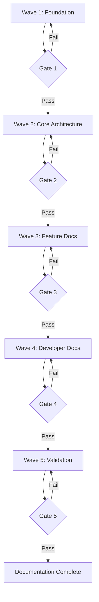

# Documentation Review Process & Quality Gates

## Purpose
This document defines the review process and quality gates that must be passed before documentation can be considered complete and ready for deployment.

## Review Philosophy

1. **Documentation is a Feature** - Quality standards match production code
2. **Test Everything** - All examples must be tested and working
3. **Progressive Quality** - Quality gates enforce standards at each phase
4. **Fail Fast** - Catch issues early through automated validation
5. **Continuous Improvement** - Metrics drive iterative improvements

## Quality Gate Structure

The documentation alignment project has **5 quality gates** aligned with the 5 execution waves:



---

## Gate 1: Foundation Standards (After Wave 1 - Phase 0.2)

**Required Deliverables:**
- [ ] Validation checklist exists at `.claude/docs/documentation-checklist.md`
- [ ] Consistency guide exists at `.claude/docs/consistency-guide.md`
- [ ] Three templates created in `.claude/docs/templates/`
- [ ] Review process documented (this file)

**Quality Criteria:**

### Validation Checklist
- [ ] Copied from global best practices (no modifications)
- [ ] Includes all required sections (Structure, Code, Examples, Visual, etc.)
- [ ] Last updated date is current

### Consistency Guide
- [ ] Defines "Remote MCP Server" terminology
- [ ] Specifies "CloudFlare Workers" (correct capitalization)
- [ ] Documents "OAuth 2.0 + PKCE" standard phrasing
- [ ] States "72 tools across 12 categories" (exact count)
- [ ] Defines "Free tier" vs "Premium tier" terminology
- [ ] Includes all 12 tool categories with counts
- [ ] Provides phrasing examples for common descriptions

### Templates
- [ ] OAUTH.md.template includes all required sections
- [ ] FEATURE.md.template includes all required sections
- [ ] TOOL_REFERENCE.md.template includes all required sections
- [ ] All templates have frontmatter with AI tags
- [ ] All templates include Mermaid diagram placeholders
- [ ] All templates include example code blocks

**Verification Commands:**
```bash
# Check files exist
ls -la .claude/docs/documentation-checklist.md
ls -la .claude/docs/consistency-guide.md
ls -la .claude/docs/templates/*.template

# Verify terminology in consistency guide
grep "Remote MCP Server" .claude/docs/consistency-guide.md
grep "72 tools across 12 categories" .claude/docs/consistency-guide.md
grep "OAuth 2.0 + PKCE" .claude/docs/consistency-guide.md
```

**Gate Pass Criteria:** All checkboxes checked, all files exist and validated

---

## Gate 2: Core Architecture (After Wave 2 - Phases 1.1, 1.2)

**Required Deliverables:**
- [ ] CLAUDE.md updated with remote architecture
- [ ] README.md rewritten as SaaS landing page

**Quality Criteria:**

### CLAUDE.md Architecture Accuracy
- [ ] Repository Overview describes "Remote MCP Server"
- [ ] Tool count is exactly "72 tools across 12 categories"
- [ ] Architecture section includes CloudFlare Workers diagram
- [ ] OAuth 2.0 + PKCE flow documented
- [ ] JWT session management explained
- [ ] Development commands include Workers mode
- [ ] Environment variables documented for both modes
- [ ] Zero mentions of "local NPX installation" or "STDIO only"
- [ ] All technical details match implementation code

### README.md SaaS Positioning
- [ ] Hero section leads with SaaS value proposition
- [ ] Zero mentions of "NPX installation" or "local server"
- [ ] OAuth authentication flow is Step 1 in Quick Start
- [ ] Free vs Premium comparison table complete
- [ ] Tool categories section lists all 12 categories with counts
- [ ] Security & Privacy section comprehensive
- [ ] Configuration examples use remote endpoint with JWT
- [ ] Quick Start achieves first task in 5 minutes
- [ ] Architecture diagram shows remote SaaS flow

### Code Examples
- [ ] All code examples use remote endpoint URLs
- [ ] All examples show JWT Bearer token authentication
- [ ] No examples use local STDIO or environment variables
- [ ] Examples tested and working

**Verification Commands:**
```bash
# Check for prohibited terms
! grep -i "local server\|npx install\|stdio" README.md CLAUDE.md
! grep "36 tools" README.md CLAUDE.md

# Verify required terms
grep "Remote MCP Server" CLAUDE.md
grep "72 tools across 12 categories" README.md CLAUDE.md
grep "OAuth 2.0 + PKCE" CLAUDE.md
grep "CloudFlare Workers" CLAUDE.md

# Count tool references
grep -c "tools across 12 categories" README.md  # Should be > 0
```

**Gate Pass Criteria:** All checkboxes checked, no prohibited terms found

---

## Gate 3: Feature Documentation (After Wave 3 - Phases 2.1-2.5)

**Required Deliverables:**
- [ ] docs/AUTHENTICATION.md created
- [ ] docs/PREMIUM_FEATURES.md created
- [ ] docs/SECURITY.md created
- [ ] docs/TOOL_REFERENCE.md created (all 72 tools)
- [ ] docs/API_REFERENCE.md updated

**Quality Criteria:**

### OAuth Documentation (AUTHENTICATION.md)
- [ ] OAuth 2.0 + PKCE flow fully explained
- [ ] Mermaid sequence diagram included
- [ ] JWT token lifecycle documented
- [ ] Token refresh procedure explained
- [ ] All auth errors documented with solutions
- [ ] Security best practices included
- [ ] Code examples in Python, TypeScript, and cURL
- [ ] Technical accuracy verified against `src/auth/oauth-service.ts`

### Premium Features Documentation
- [ ] Free vs Premium comparison complete
- [ ] All premium-only tools listed
- [ ] Pricing clearly stated ($4.99/month)
- [ ] Stripe integration explained
- [ ] Upgrade/downgrade procedures documented
- [ ] Billing FAQ addresses common questions

### Security Documentation
- [ ] Encryption at rest (AES-256-GCM) explained
- [ ] JWT security covered
- [ ] Rate limiting documented
- [ ] Audit logging explained
- [ ] GDPR compliance addressed
- [ ] Multi-tenant isolation described

### Tool Reference (All 72 Tools)
- [ ] All 12 categories documented
- [ ] Exact tool count per category matches test-all-tools-ultrathink.js
- [ ] Each tool has description, parameters, examples, errors
- [ ] Tier markers (Free/Premium) on all tools
- [ ] Usage examples for common workflows
- [ ] Related tools cross-referenced

### API Reference
- [ ] Remote MCP endpoints documented
- [ ] Authentication headers explained
- [ ] Error codes and responses documented
- [ ] Rate limiting details included
- [ ] Transport options (HTTP Streamable, SSE) explained

**Verification Commands:**
```bash
# Check files exist
ls -la docs/AUTHENTICATION.md docs/PREMIUM_FEATURES.md docs/SECURITY.md docs/TOOL_REFERENCE.md docs/API_REFERENCE.md

# Verify tool count accuracy
node test-all-tools-ultrathink.js  # Should show 72 tools
grep "72 tools" docs/TOOL_REFERENCE.md

# Verify OAuth terminology
grep "OAuth 2.0 + PKCE" docs/AUTHENTICATION.md
grep "JWT session tokens" docs/AUTHENTICATION.md

# Check for Mermaid diagrams
grep "```mermaid" docs/AUTHENTICATION.md
```

**Gate Pass Criteria:** All 5 files exist, tool count accurate, all checkboxes checked

---

## Gate 4: Developer Experience (After Wave 4 - Phases 3.1-3.4)

**Required Deliverables:**
- [ ] docs/DEPLOYMENT.md updated
- [ ] docs/DEVELOPER_GUIDE.md created
- [ ] docs/TROUBLESHOOTING.md created
- [ ] docs/MIGRATION_GUIDE.md created

**Quality Criteria:**

### Deployment Documentation
- [ ] CloudFlare Workers deployment steps
- [ ] Environment variable configuration
- [ ] KV and R2 setup instructions
- [ ] CI/CD pipeline examples
- [ ] Wrangler commands documented
- [ ] Production checklist included

### Developer Guide
- [ ] Local development setup complete
- [ ] Prerequisites clearly stated
- [ ] Testing procedures documented
- [ ] Contribution guidelines included
- [ ] Code style standards referenced
- [ ] Development workflow explained

### Troubleshooting Documentation
- [ ] All common OAuth issues covered
- [ ] Token expiration handling
- [ ] Rate limiting issues
- [ ] API error debugging
- [ ] Environment config issues
- [ ] Solutions actionable and tested

### Migration Guide
- [ ] Rationale for remote architecture explained
- [ ] Side-by-side comparison (local vs remote)
- [ ] Migration steps clear and complete
- [ ] Backward compatibility notes
- [ ] Deprecation timeline (if applicable)

**Verification Commands:**
```bash
# Check files exist
ls -la docs/DEPLOYMENT.md docs/DEVELOPER_GUIDE.md docs/TROUBLESHOOTING.md docs/MIGRATION_GUIDE.md

# Verify deployment references CloudFlare
grep "CloudFlare Workers\|Wrangler" docs/DEPLOYMENT.md

# Check troubleshooting has OAuth section
grep -i "oauth" docs/TROUBLESHOOTING.md
```

**Gate Pass Criteria:** All 4 files exist and complete, all checkboxes checked

---

## Gate 5: Final Validation (After Wave 5 - Phases 4.1-4.3)

**Required Deliverables:**
- [ ] Consistency review report
- [ ] Example validation report
- [ ] User journey test results

**Quality Criteria:**

### Consistency Review (Phase 4.1)
- [ ] All 10+ docs use "Remote MCP Server" consistently
- [ ] Tool count "72 across 12 categories" everywhere
- [ ] OAuth phrasing matches consistency guide
- [ ] CloudFlare capitalization correct everywhere
- [ ] No local/NPX references remain
- [ ] Cross-references working and accurate
- [ ] Terminology consistent across all files

### Example Validation (Phase 4.2)
- [ ] All code examples tested
- [ ] No syntax errors in any examples
- [ ] All configuration snippets valid
- [ ] Tool usage examples accurate
- [ ] OAuth flow examples working
- [ ] test-all-tools-ultrathink.js passes all 72 tools

### User Journey Testing (Phase 4.3)
- [ ] OAuth signup flow works as documented
- [ ] Quick Start achieves goal in 5 minutes
- [ ] Premium upgrade flow clear and functional
- [ ] Developer setup succeeds
- [ ] All links working (no 404s)
- [ ] Images/diagrams render correctly

**Verification Commands:**
```bash
# Run comprehensive validation
python ~/.claude/scripts/validate_documentation.py --project . --strict

# Test all examples
npm run test:examples

# Validate all 72 tools
node test-all-tools-ultrathink.js

# Check for broken links
find docs -name "*.md" -exec markdown-link-check {} \;

# Consistency checks
grep -r "MCP Server" docs/ | grep -v "Remote MCP Server"  # Should be empty
grep -r "36 tools" docs/  # Should be empty
grep -r "local server\|npx install" docs/  # Should be empty
```

**Gate Pass Criteria:** All tests pass, no errors, all checkboxes checked

---

## Review Process Workflow

### 1. Self-Review (Author)
Before submitting for review, author must:
- [ ] Run validation checklist from `.claude/docs/documentation-checklist.md`
- [ ] Verify against consistency guide
- [ ] Test all code examples
- [ ] Check for prohibited terminology
- [ ] Validate cross-references

### 2. Automated Review (CI/CD)
Automated checks run on every commit:
```yaml
# .github/workflows/docs-validation.yml
- name: Validate Documentation
  run: |
    python .claude/scripts/validate_docs.py --strict
    node test-all-tools-ultrathink.js
    npm run test:examples
```

### 3. Peer Review
Reviewer checklist:
- [ ] Technical accuracy verified
- [ ] Examples tested
- [ ] Terminology consistent
- [ ] User perspective considered
- [ ] Accessibility checked

### 4. Quality Gate Check
Before proceeding to next wave:
- [ ] All gate criteria met
- [ ] Verification commands pass
- [ ] Deliverables complete
- [ ] Sign-off obtained

## Enforcement Mechanisms

### Pre-Commit Hooks
```bash
# .git/hooks/pre-commit
python .claude/scripts/validate_docs.py --quick
```

### CI/CD Pipeline
```yaml
# Fail build if documentation standards not met
- name: Documentation Quality Gate
  run: |
    python .claude/scripts/validate_docs.py --strict
  if: failure()
    run: echo "Documentation quality gate failed"
    exit 1
```

### Pull Request Template
```markdown
## Documentation Checklist
- [ ] Validated against consistency guide
- [ ] All examples tested
- [ ] No prohibited terminology
- [ ] Quality gate criteria met
```

## Metrics & Reporting

### Quality Metrics
Track these metrics for continuous improvement:
- Documentation coverage: % of tools documented
- Example accuracy: % of examples that pass tests
- Consistency score: % of docs using standard terminology
- Completeness: % of required sections present
- Freshness: Days since last update

### Gate Performance
Track gate passage rates:
- Gate 1: [X%] pass rate
- Gate 2: [X%] pass rate
- Gate 3: [X%] pass rate
- Gate 4: [X%] pass rate
- Gate 5: [X%] pass rate

### Reporting Dashboard
```bash
# Generate quality report
python ~/.claude/scripts/docs-quality-report.py

# Output:
# Documentation Quality Report
# ============================
# Total Documents: 10
# Consistency Score: 98%
# Example Pass Rate: 100%
# Coverage: 72/72 tools (100%)
# Gate Status: 5/5 passed
```

## Continuous Improvement

### Monthly Review
- Analyze metrics and identify issues
- Update standards based on learnings
- Refine quality gates if needed
- Improve automation tools

### Feedback Integration
- User feedback → Update troubleshooting
- Support tickets → Clarify documentation
- Analytics → Identify confusing sections
- Developer feedback → Improve examples

---

## Appendix: Quick Reference

### Prohibited Terms
❌ "MCP Server" (alone)
❌ "Local server"
❌ "NPX installation"
❌ "STDIO"
❌ "36 tools"
❌ "Cloudflare" (wrong case)

### Required Terms
✅ "Remote MCP Server"
✅ "CloudFlare Workers"
✅ "OAuth 2.0 + PKCE"
✅ "72 tools across 12 categories"
✅ "JWT session tokens"
✅ "Free tier" / "Premium tier"

### Validation Commands
```bash
# Quick validation
python .claude/scripts/validate_docs.py --quick

# Full validation
python .claude/scripts/validate_docs.py --strict

# Test examples
npm run test:examples

# Test all tools
node test-all-tools-ultrathink.js
```

---
*This review process ensures documentation quality meets production standards.*
*Last Updated: 2024-10-28*
