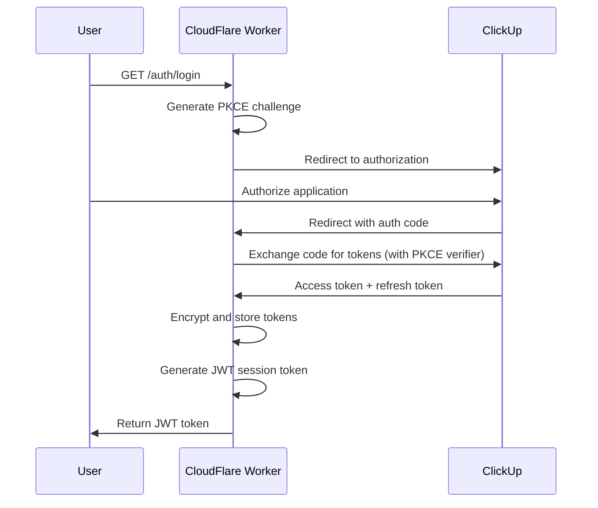

# OAuth & Authentication Documentation

## Epic: OAuth & Authentication Documentation

Create comprehensive OAuth 2.0 + PKCE authentication documentation with flow diagrams, JWT token management, and troubleshooting guide.

**Estimated Duration**: 4h
**Phase**: 2
**Priority**: high
**Complexity**: Standard

## Methodology Guidance

This task follows the **Distributed SPECTRA** methodology for autonomous agent execution.

**Your Focus**: Context → Clarify (if needed) → Implement → Test → Refine → Handoff

**Time Allocation Guide**:
- Context Gathering (5-10%): Review OAuth implementation code, CLAUDE.md architecture
- Implementation (40-50%): Write comprehensive OAuth documentation with diagrams
- Testing (25-30%): Validate technical accuracy, test examples
- Refinement (5-10%): Ensure clarity for both technical and non-technical users
- Handoff (5-10%): Document OAuth patterns for troubleshooting guide

**Wave Context**: Wave 3 (Feature Documentation) - Parallel Stream 1

Review handoffs from: phase-1-1-finalize-claude-md.md (OAuth architecture)

Can run in parallel with: Phase 2.2, 2.3, 2.4, 2.5

**Quality Requirements**:
- ✅ OAuth flow technically accurate (verified against implementation)
- ✅ Mermaid diagrams clear and comprehensive
- ✅ JWT lifecycle fully explained
- ✅ All error scenarios documented with solutions

📚 **Full Methodology**: `~/.claude/docs/agent-task-execution-methodology.md`

## Context

**Why this matters**: OAuth is the core authentication mechanism. Users must understand how to authenticate without confusion. Any errors in this documentation will block user onboarding.

**What it depends on**:
- Phase 1.1 (CLAUDE.md for OAuth architecture)
- src/auth/oauth-service.ts (actual OAuth implementation)

**What depends on it**:
- User onboarding success
- Phase 3.3 (Troubleshooting guide references this)

## Tasks

- [ ] Create docs/AUTHENTICATION.md file (10m) - Agent: Technical Writer
  - Use documentation template
  - Add frontmatter with AI-optimized metadata
  - Set up document structure

- [ ] Document OAuth 2.0 + PKCE flow (90m) - Agent: Backend Specialist
  - Explain why OAuth over API keys
  - Step-by-step authorization flow:
    1. User initiates login
    2. Generate PKCE challenge
    3. Redirect to ClickUp authorization
    4. User authorizes
    5. ClickUp redirects with auth code
    6. Exchange auth code for tokens (with PKCE verifier)
    7. Store encrypted tokens
    8. Generate JWT session token
  - Create Mermaid sequence diagram
  - Include code examples for each step
  - Explain security benefits of PKCE

- [ ] Document JWT session management (60m) - Agent: Backend Specialist
  - JWT token structure and claims
  - Token lifetime (24 hours default)
  - Token storage (how and where)
  - Token refresh procedure
  - Token expiration handling
  - Security best practices
  - Include code examples

- [ ] Document token refresh flow (30m) - Agent: Backend Specialist
  - When to refresh (proactive vs reactive)
  - Refresh endpoint details
  - Handling refresh failures
  - Fallback to re-authentication
  - Create Mermaid diagram

- [ ] Add authentication troubleshooting (45m) - Agent: Technical Writer
  - Common OAuth errors and solutions:
    - "Invalid client" → Check client ID
    - "Invalid redirect URI" → Verify configuration
    - "User denied" → Retry authorization
    - "Token expired" → Refresh or re-authenticate
  - JWT token errors:
    - "Token malformed" → Check format
    - "Token expired" → Refresh
    - "Invalid signature" → Re-authenticate
  - Network issues and CORS problems

- [ ] Include security best practices (30m) - Agent: Security Specialist
  - Never store API keys in code
  - JWT token protection (HTTP-only cookies if applicable)
  - Secure token transmission (HTTPS only)
  - Token rotation recommendations
  - Audit logging for authentication events

- [ ] Create code examples (45m) - Agent: Backend Specialist
  - Python example: OAuth flow and JWT usage
  - TypeScript example: OAuth flow and JWT usage
  - cURL examples for manual testing
  - MCP client configuration examples
  - Token refresh examples

## Acceptance Criteria

- [ ] docs/AUTHENTICATION.md created with complete OAuth documentation
- [ ] OAuth 2.0 + PKCE flow fully explained with Mermaid sequence diagram
- [ ] JWT token lifecycle documented (creation, storage, refresh, expiration)
- [ ] Token refresh procedure clearly explained
- [ ] All common authentication errors documented with solutions
- [ ] Security best practices included
- [ ] Code examples provided in Python, TypeScript, and cURL
- [ ] Technical accuracy verified against src/auth/oauth-service.ts
- [ ] Diagrams are clear and easy to understand
- [ ] Non-technical users can follow the flow
- [ ] Handoff created documenting OAuth patterns for troubleshooting guide

## Dependencies

- Depends on: Phase 1.1 (CLAUDE.md for OAuth architecture)
- Parallel with: Phase 2.2, 2.3, 2.4, 2.5 (can run concurrently)
- Blocks: None directly, but informs Phase 3.3 (Troubleshooting)

## Technical Notes

**OAuth Implementation Reference**:
- `src/auth/oauth-service.ts` - OAuth 2.0 + PKCE implementation
- `src/worker.ts` - OAuth endpoints (/auth/login, /auth/callback, /auth/refresh)
- PKCE challenge generation and verification
- Token exchange and encryption

**JWT Token Claims**:
```json
{
  "sub": "user_id",
  "email": "user@example.com",
  "team_id": "clickup_team_id",
  "tier": "free" | "premium",
  "iat": 1234567890,
  "exp": 1234654290
}
```

**OAuth Endpoints**:
- `GET /auth/login` - Initiates OAuth flow
- `GET /auth/callback` - Handles ClickUp redirect
- `POST /auth/refresh` - Refreshes JWT token

**Mermaid Diagram Example**:


**Risks**:
- Technical details too complex → Mitigation: Explain in layers (simple first, details later)
- Diagrams unclear → Mitigation: Multiple diagrams for different aspects
- Security guidance incomplete → Mitigation: Consult security best practices

## Resources

- [OAuth Implementation](src/auth/oauth-service.ts)
- [Worker Endpoints](src/worker.ts)
- [ClickUp OAuth Docs](https://clickup.com/api/developer-portal/oauth)
- [OAuth 2.0 RFC](https://oauth.net/2/)
- [PKCE RFC](https://oauth.net/2/pkce/)
- [JWT Docs](https://jwt.io/)
- [Documentation Standards](.claude/docs/documentation-checklist.md)
