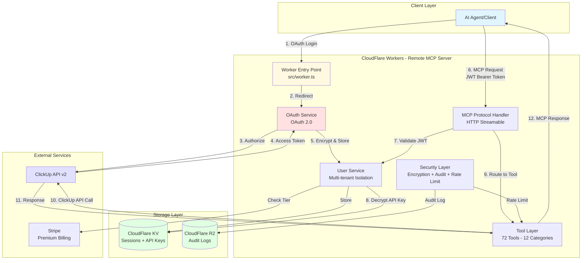

# CLAUDE.md

This file provides guidance to Claude Code (claude.ai/code) when working with code in this repository.

## Repository Overview

ClickUp MCP Server - A Remote MCP Server hosted on CloudFlare Workers that enables AI agents to securely interact with ClickUp workspaces through OAuth 2.0 authentication. Provides 72 tools across 12 categories for comprehensive task management, time tracking, and workspace operations.

## Tool Categories

The Remote MCP Server provides **72 tools across 12 categories**:

| Category | Tool Count | Description |
|----------|------------|-------------|
| **Task Management** | 27 | Create, update, search, and manage tasks with full CRUD operations |
| **List Management** | 12 | Organize tasks into lists, manage list settings and permissions |
| **Workspace Operations** | 8 | Manage workspace hierarchy, spaces, and team structure |
| **Time Tracking** | 6 | Track time, manage time entries, and generate time reports |
| **Custom Fields** | 5 | Create and manage custom fields for tasks and lists |
| **Space Management** | 4 | Organize work into spaces with tags and settings |
| **Goal Tracking** | 3 | Create and monitor goals with key results |
| **User Management** | 2 | Manage user accounts and permissions |
| **Team Management** | 2 | Handle team configuration and member roles |
| **Comment Management** | 2 | Add and manage comments on tasks |
| **View Management** | 1 | Create and configure custom views |
| **Other** | 1 | Additional utility tools |

All tools are tested and validated via `tests/scripts/test-all-tools-ultrathink.js` which performs comprehensive ultra-think analysis.

## Build and Development Commands

```bash
# CloudFlare Workers Development
npm install                     # Install dependencies
npm run build:worker           # Build for CloudFlare Workers
npm run dev:worker             # Local development with Wrangler
npm run deploy:dev             # Deploy to development
npm run deploy:production      # Deploy to production

# Traditional MCP Development (for local testing)
npm run build                  # Compile TypeScript to JavaScript
npm run dev                    # Watch mode for development
node build/index.js            # Direct execution (requires API keys)

# Testing
npm run test                   # Run test suite
npm run test:ultrathink        # Test all 72 tools with ultra-think analysis
```

## Architecture - Remote MCP Server

### CloudFlare Workers SaaS Architecture



The codebase implements a **remote MCP server** on CloudFlare Workers with multi-tenant OAuth authentication:

- **Worker Entry Point** (`src/worker.ts`) - Hono-based HTTP handler with OAuth endpoints
- **OAuth Service** (`src/auth/`) - ClickUp OAuth 2.0 implementation
- **User Management** (`src/services/user-service.ts`) - Multi-tenant user isolation and API key encryption
- **Security Layer** (`src/security/`) - Encryption, audit logging, rate limiting
- **Transport Layer** - HTTP Streamable for remote MCP protocol, SSE for legacy support
- **Storage Layer** - CloudFlare KV for sessions, R2 for audit logs

### Traditional MCP Mode (Legacy)
Also supports traditional local MCP server mode:
- **BaseClickUpService** (`src/services/clickup/base.ts`) - Base class providing error handling, rate limiting, and API communication
- **Service Composition** - TaskService uses composition of specialized services (Core, Search, Comments, Attachments, Tags, CustomFields)
- **Tool Layer** (`src/tools/`) - MCP protocol handlers that delegate to services

### Key Architectural Principles

1. **Multi-Tenancy**: User isolation with encrypted API key storage and session management
2. **OAuth Security**: OAuth 2.0 flow with JWT session tokens
3. **Composition over Inheritance**: TaskService uses composition pattern - follow this pattern when extending
4. **Service Separation**: Each ClickUp entity has its own service - maintain this separation
5. **Tool-Service Delegation**: Tools handle MCP protocol, services handle ClickUp API
6. **Security by Design**: All user data encrypted at rest, comprehensive audit logging

## Core Components

### TaskService Composition (`src/services/clickup/task/`)
- `index.ts` - Main TaskService that composes all task-related functionality
- `core.ts` - Basic CRUD operations
- `search.ts` - Search and filtering capabilities
- `comments.ts` - Comment management
- `attachments.ts` - File attachment handling
- `tags.ts` - Task tagging operations
- `custom-fields.ts` - Custom field management

### Transport Configuration

#### Remote MCP Server (`src/worker.ts`)
- **HTTP Streamable**: Primary transport for remote MCP protocol
- **OAuth Endpoints**: `/auth/login`, `/auth/callback`, `/auth/refresh`
- **MCP Endpoint**: `/mcp` with JWT authentication headers
- **WebSocket Support**: Real-time MCP connections

#### Traditional Mode (`src/index.ts`)
- Determines transport based on environment variables
- STDIO is default, SSE enabled with `ENABLE_SSE=true`
- HTTP Streamable for modern MCP clients

### Natural Language Processing (`src/utils/date-utils.ts`)
- 47+ date patterns with sub-millisecond parsing
- Used by task creation/update tools for due dates

### Authentication & Security (`src/auth/`, `src/security/`)
- **OAuth 2.0**: Secure ClickUp authentication without API key exposure
- **JWT Sessions**: 24-hour session tokens with automatic refresh
- **AES-256-GCM Encryption**: All stored API keys encrypted at rest
- **Rate Limiting**: Per-user limits (100/min free, 500/min premium)
- **Audit Logging**: All actions logged to CloudFlare R2 for security monitoring

## Development Patterns

### Adding New Tools
1. Create tool definition in appropriate file under `src/tools/`
2. Implement corresponding service method if needed
3. Register tool in `src/server.ts`
4. Follow existing naming convention: `clickup_[entity]_[action]`

### Service Extension
When extending services:
```typescript
// Follow composition pattern for complex services
class NewTaskFeatureService extends BaseClickUpService {
  // Implement specific functionality
}

// Compose into TaskService
class TaskService extends BaseClickUpService {
  private newFeature: NewTaskFeatureService;
  
  constructor(apiKey: string, teamId: string) {
    super(apiKey, teamId);
    this.newFeature = new NewTaskFeatureService(apiKey, teamId);
  }
}
```

### Error Handling
All API errors should be caught and transformed in BaseClickUpService:
```typescript
// Errors are automatically mapped to user-friendly messages
throw new Error(`ClickUp API Error: ${error.response?.data?.err || error.message}`);
```

## Testing and Validation

### Remote MCP Testing
```bash
# Test OAuth flow
curl https://your-worker.workers.dev/auth/login

# Test MCP endpoint with JWT
curl -X POST https://your-worker.workers.dev/mcp \
  -H "Authorization: Bearer YOUR_JWT_TOKEN" \
  -H "Content-Type: application/json" \
  -d '{"method": "tools/list"}'

# Ultra-think comprehensive testing
npm run test:ultrathink
```

### Traditional MCP Testing
```bash
# Test with MCP Inspector
npm run build
npx @modelcontextprotocol/inspector build/index.js

# Test specific tools
node build/index.js --test-tool clickup_task_create
```

### Environment Variables

#### CloudFlare Workers Environment
```bash
# OAuth Configuration
CLICKUP_CLIENT_ID=xxx
CLICKUP_CLIENT_SECRET=xxx
OAUTH_REDIRECT_URI=https://your-worker.workers.dev/auth/callback

# Security
ENCRYPTION_KEY=xxx         # AES-256-GCM encryption key
JWT_SECRET=xxx             # JWT signing secret

# Feature Flags
ENABLE_AUDIT_LOGGING=true
ENABLE_RATE_LIMITING=true
MAX_REQUESTS_PER_MINUTE=100
FREE_TIER_TOOLS=get_workspace_hierarchy,create_task,get_task,update_task
PREMIUM_TIER_TOOLS=create_bulk_tasks,time_tracking,custom_fields

# Stripe (Optional)
STRIPE_SECRET_KEY=xxx
STRIPE_WEBHOOK_SECRET=xxx
STRIPE_PRICE_ID=xxx
```

#### Traditional Mode Environment
```bash
# Core (required)
CLICKUP_API_KEY=pk_xxx
CLICKUP_TEAM_ID=xxx

# Optional features
DOCUMENT_SUPPORT=true      # Enable document tools
LOG_LEVEL=debug            # Enable debug logging
ENABLED_TOOLS=task,list    # Whitelist specific tool categories
```

## Common Development Tasks

### Adding Rate Limiting
Rate limiting is handled in BaseClickUpService. Adjust parameters in `src/services/clickup/base.ts`:
```typescript
private rateLimitDelay = 100; // Milliseconds between requests
```

### Implementing Bulk Operations
Use the concurrency utilities for bulk operations:
```typescript
import { processInBatches } from '../utils/concurrency-utils';
await processInBatches(items, async (item) => {
  // Process each item
}, 5); // Batch size
```

### Adding Custom Fields Support
Custom fields are handled through TaskServiceCustomFields. When adding support to other entities:
1. Create a dedicated custom fields service
2. Compose it into the main entity service
3. Follow the existing pattern in `src/services/clickup/task/custom-fields.ts`

## Important Considerations

### Remote MCP Server
- **OAuth First**: Users authenticate via OAuth, never handle raw API keys
- **JWT Sessions**: All requests require valid JWT tokens in Authorization headers
- **Multi-Tenancy**: Ensure complete user isolation and data encryption
- **Rate Limiting**: Enforce per-user limits based on subscription tier
- **Audit Trail**: Log all user actions for security and compliance
- **Tier Enforcement**: Restrict premium tools to paying subscribers

### Traditional MCP Mode
- **Workspace Context**: Most operations require workspace hierarchy - always ensure WorkspaceService is available
- **ID Formats**: Support both ClickUp IDs and custom task IDs (e.g., "TASK-123")
- **Disambiguation**: When multiple items have the same name, provide context (space/folder/list)
- **Performance**: Use bulk operations and caching where appropriate
- **Security**: Never log API keys or sensitive data
- **Backward Compatibility**: Maintain tool signatures when refactoring services

### Universal Considerations
- **Tool Count**: Server provides 72 tools across 12 categories (verified via ultra-think testing)
- **Error Handling**: Provide clear, actionable error messages for all failure modes
- **Testing**: Use comprehensive testing methodology to validate all tools

---

## Documentation Handoff Notes

### For Phase 1.2 (README.md Rewrite)

**Architecture Established:** This CLAUDE.md now serves as the single source of truth for the Remote MCP Server architecture. All information in README.md should align with the architecture described here.

**Key Points to Emphasize in README.md:**
1. **Remote SaaS Model:** CloudFlare Workers-hosted, not local installation
2. **OAuth Authentication:** OAuth 2.0 flow, not API key environment variables
3. **Exact Tool Count:** 72 tools across 12 categories (see Tool Categories section above)
4. **Premium Tier:** $4.99/month for enhanced rate limits (500 req/min) and premium tools
5. **JWT Sessions:** 24-hour session tokens with Bearer authentication
6. **Multi-Tenancy:** Complete user isolation with encrypted API key storage

**Prohibited Terms in README.md:**
- ❌ "Local server", "NPX installation", "STDIO"
- ❌ "36 tools" or any count other than "72 tools across 12 categories"
- ❌ "API key environment variables" as primary setup
- ❌ "Cloudflare" (wrong capitalization - use "CloudFlare")

**Required Sections for README.md:**
1. Hero section with SaaS value proposition
2. OAuth Quick Start (5-minute first task creation)
3. Free vs Premium comparison table
4. Tool Categories summary (reference this document's table)
5. Security & Privacy section (OAuth, encryption, JWT)
6. Architecture diagram (can reference or embed the Mermaid diagram above)

**Reference Files:**
- Tool categories: See "Tool Categories" section above
- Architecture diagram: See "CloudFlare Workers SaaS Architecture" section
- Environment variables: See "Environment Variables > CloudFlare Workers Environment"
- Consistency guide: `.claude/docs/consistency-guide.md`
- OAuth template: `.claude/docs/templates/OAUTH.md.template`

This CLAUDE.md was finalized as part of Phase 1.1 (Wave 2) and is ready for Phase 1.2 (README.md rewrite).