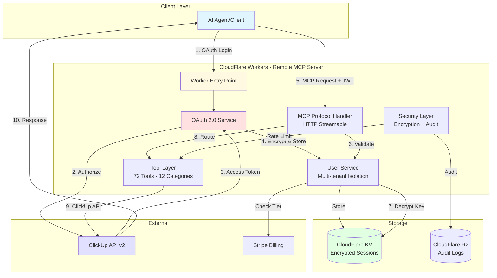

[](https://github.com/YOUR_GITHUB_USERNAME/clickup-remote-mcp-server/stargazers)
[](https://github.com/YOUR_GITHUB_USERNAME/clickup-remote-mcp-server/graphs/commit-activity)

# ClickUp MCP Server - Remote SaaS


**Securely connect your ClickUp workspace to AI assistants without managing API keys.**

A Remote MCP Server hosted on CloudFlare Workers that enables AI agents to interact with ClickUp workspaces through OAuth 2.0 authentication. Transform your task management workflow with **72 tools across 12 categories**.

> 🚀 **Ready to get started?** [Authenticate with ClickUp →](https://clickup-mcp.workers.dev/auth/login)

## ✨ Key Benefits

- **🔐 Zero API Key Management** - OAuth 2.0 secure authentication
- **☁️ Always Available** - Hosted on CloudFlare Workers global network
- **🚀 72 Tools Across 12 Categories** - Comprehensive ClickUp integration
- **💎 Free & Premium Tiers** - Start free, upgrade for advanced features
- **🛡️ Enterprise Security** - Encrypted storage, audit logging, rate limiting
- **⚡ Lightning Fast** - Sub-100ms response times globally

## 🆚 Free vs Premium

| Feature                  | Free Tier                     | Premium Tier ($4.99/mo)              |
| ------------------------ | ----------------------------- | ------------------------------------ |
| **Basic Operations**     | ✅ Create, read, update tasks | ✅ All free features                 |
| **Workspace Navigation** | ✅ Hierarchy, lists, folders  | ✅ Enhanced navigation               |
| **Rate Limits**          | 100 requests/minute           | ⚡ 500 requests/minute               |
| **Bulk Operations**      | ❌                            | ✅ Create/update/move multiple tasks |
| **Time Tracking**        | ❌                            | ✅ Start/stop timers, time entries   |
| **Custom Fields**        | ❌                            | ✅ Full custom field management      |
| **Project Management**   | ❌                            | ✅ Gantt charts, milestones          |
| **Advanced Tools**       | ❌                            | ✅ 40+ premium tools                 |
| **Support**              | Community                     | 📞 Priority support                  |

## 🚀 Quick Start (5 minutes)

### Step 1: Authenticate with ClickUp OAuth

Click the authentication link to start the secure OAuth 2.0 flow:

```
https://clickup-mcp.workers.dev/auth/login
```

**What happens:**

1. You'll be redirected to ClickUp's authorization page
2. Log in and authorize access to your workspace
3. ClickUp redirects back with an authorization code
4. The server securely exchanges the code for an access token
5. Your access token is encrypted and stored securely
6. You receive a JWT session token (24-hour lifetime)

**Security Note:** You never expose your ClickUp API key! OAuth handles all authentication automatically and securely.

### Step 2: Save Your JWT Session Token

After authorization, you'll receive a JWT token. Save it securely - you'll need it to configure your AI client.

**Example JWT token:**

```
eyJhbGciOiJIUzI1NiIsInR5cCI6IkpXVCJ9.eyJ1c2VyX2lkIjoiMTIzNDU2Iiwi...
```

**Token Details:**

- 24-hour lifetime (auto-expires for security)
- Use `/auth/refresh` endpoint to renew before expiry
- Stored JWT contains: user ID, workspace ID, tier level

### Step 3: Configure Your AI Client

#### Claude Desktop Configuration

Add this to your MCP settings:

```json
{
  "mcpServers": {
    "clickup": {
      "url": "https://clickup-mcp.workers.dev/mcp",
      "headers": {
        "Authorization": "Bearer YOUR_JWT_TOKEN"
      },
      "name": "ClickUp Workspace",
      "description": "Manage ClickUp tasks and projects"
    }
  }
}
```

#### Other MCP Clients

Most MCP-compatible clients support remote servers. Use:

- **URL**: `https://clickup-mcp.workers.dev/mcp`
- **Authentication**: Bearer token in headers
- **Transport**: HTTP Streamable (recommended)

## 🛠️ Available Tools (72 Across 12 Categories)

### Core Tools (Free Tier)

| Category            | Tools   | Description                                     |
| ------------------- | ------- | ----------------------------------------------- |
| **Workspace**       | 3 tools | Navigate hierarchy, get members, view structure |
| **Basic Tasks**     | 8 tools | Create, read, update, delete, move, duplicate   |
| **Lists & Folders** | 6 tools | Manage organizational structure                 |
| **Comments**        | 2 tools | Add and view task comments                      |

### Premium Tools

| Category               | Tools   | Description                               |
| ---------------------- | ------- | ----------------------------------------- |
| **Bulk Operations**    | 6 tools | Create/update/move/delete multiple items  |
| **Time Tracking**      | 5 tools | Start/stop timers, manage time entries    |
| **Custom Fields**      | 6 tools | Full custom field management              |
| **Project Management** | 5 tools | Gantt charts, milestones, templates       |
| **Advanced Tasks**     | 6 tools | Scheduling, dependencies, parallel groups |
| **Documents**          | 7 tools | Create and manage ClickUp documents       |
| **Space Management**   | 7 tools | Advanced space operations                 |
| **Tags**               | 3 tools | Tag management and organization           |
| **Dependencies**       | 5 tools | Task relationships and links              |
| **Attachments**        | 3 tools | File management                           |

### Tool Categories Breakdown

```
📊 Total: 72 tools across 12 categories
┣━ 📝 Task Management: 27 tools (core CRUD + advanced features)
┣━ 📋 List Management: 12 tools (organization and list operations)
┣━ 🌐 Workspace Operations: 8 tools (hierarchy and workspace navigation)
┣━ ⏱️ Time Tracking: 6 tools (productivity and time management)
┣━ 🔧 Custom Fields: 5 tools (metadata and custom properties)
┣━ 🏢 Space Management: 4 tools (space organization)
┣━ 🎯 Goal Tracking: 3 tools (OKRs and goal management)
┣━ 👤 User Management: 2 tools (user accounts and permissions)
┣━ 👥 Team Management: 2 tools (team configuration)
┣━ 💬 Comment Management: 2 tools (task discussions)
┣━ 👁️ View Management: 1 tool (custom views)
┗━ 🔗 Other: 1 tool (utilities)
```

All tools tested and validated via `npm run test:ultrathink`

## 💎 Upgrade to Premium

### Instant Activation

Get your premium subscription link:

```bash
curl -X POST https://clickup-mcp.workers.dev/stripe/create-checkout \
  -H "Authorization: Bearer YOUR_JWT_TOKEN"
```

Complete payment through Stripe's secure checkout and premium features activate immediately!

### Why Upgrade?

- **10x Productivity** with bulk operations
- **Time Tracking** integrated into AI workflows
- **Complex Project Management** with dependencies and scheduling
- **5x Rate Limits** for power users
- **Priority Support** when you need help

## 🔒 Security & Privacy

### How We Protect Your Data

- **🔐 AES-256-GCM Encryption** - All API keys encrypted at rest
- **🛡️ OAuth 2.0** - Industry-standard secure authentication
- **⏰ Session Management** - JWT tokens auto-expire after 24 hours
- **📊 Audit Logging** - Complete action history for security monitoring
- **🚪 User Isolation** - Complete data separation between users
- **🌍 Global Edge** - CloudFlare's security infrastructure

### What We Store

✅ **Encrypted API Keys** - For workspace access
✅ **Team IDs** - To identify your workspace
✅ **Session Tokens** - Auto-expire after 24 hours
✅ **Usage Metrics** - Anonymous for rate limiting

### What We Don't Store

❌ Your ClickUp password
❌ Task content or descriptions
❌ Unencrypted sensitive data
❌ Personal information beyond email

## 🏗️ Architecture

The Remote MCP Server uses a secure, scalable architecture on CloudFlare Workers:



**Architecture Highlights:**

- **OAuth 2.0**: Secure authorization without exposing API keys
- **JWT Sessions**: Stateless authentication with 24-hour tokens
- **AES-256-GCM Encryption**: All API keys encrypted at rest in CloudFlare KV
- **Multi-Tenancy**: Complete user isolation with per-user rate limiting
- **Global Edge**: Deployed on CloudFlare's 300+ data centers worldwide
- **Audit Trail**: All actions logged to CloudFlare R2 for security monitoring

## 🚀 Usage Examples

Once configured, use natural language with your AI assistant:

### Basic Task Management

```
"Create a task called 'Review Q1 Reports' due next Monday in my Marketing list"

"Update the task 'Website Redesign' status to 'In Progress'"

"Show me all tasks in the Development folder"
```

### Time Tracking (Premium)

```
"Start tracking time on the 'Client Meeting Prep' task"

"Log 2 hours on the 'Code Review' task for yesterday"

"Show me my time entries for this week"
```

### Bulk Operations (Premium)

```
"Create 5 tasks for the sprint planning:
1. Setup environment
2. Database migration
3. API development
4. Frontend integration
5. Testing and QA"

"Move all 'In Review' tasks to 'Completed'"
```

### Project Management (Premium)

```
"Create a project plan with dependencies for our website launch"

"Generate a Gantt chart for the current sprint"

"Set up milestones for the Q2 product release"
```

## 🛠️ Development & Self-Hosting

### Local Development

```bash
# Clone repository
git clone https://github.com/YOUR_GITHUB_USERNAME/clickup-remote-mcp-server.git
cd clickup-mcp-server

# Install dependencies
npm install

# CloudFlare Workers development
npm run dev:worker

# Traditional MCP development
npm run build && npm start
```

### Self-Hosting on CloudFlare Workers

See [DEPLOYMENT.md](DEPLOYMENT.md) for complete self-hosting instructions including:

- CloudFlare Workers setup
- OAuth app configuration
- KV namespace creation
- Environment variables
- Security configuration

### Testing

```bash
# Run comprehensive tool testing
npm run test:ultrathink

# Run unit tests
npm test

# Test specific functionality
npm run test:integration
```

## 🌐 Alternative Installation Methods

### NPX Installation (Traditional Local MCP)

For users who prefer local installation:

```json
{
  "mcpServers": {
    "ClickUp": {
      "command": "npx",
      "args": ["-y", "@YOUR_GITHUB_USERNAME/clickup-remote-mcp-server@latest"],
      "env": {
        "CLICKUP_API_KEY": "your-api-key",
        "CLICKUP_TEAM_ID": "your-team-id"
      }
    }
  }
}
```

**Note**: Local installation requires manual API key management and lacks the security, scalability, and premium features of the hosted version.

## 🔧 Configuration Options

### Tool Filtering

Control which tools are available:

```bash
# Environment variables for self-hosting
FREE_TIER_TOOLS="get_workspace_hierarchy,create_task,get_task,update_task"
PREMIUM_TIER_TOOLS="create_bulk_tasks,time_tracking_tools,custom_fields"
```

### Rate Limiting

```bash
# Adjust limits based on subscription
MAX_REQUESTS_PER_MINUTE=100  # Free tier
MAX_REQUESTS_PER_MINUTE=500  # Premium tier
```

## 📊 API Endpoints

The remote MCP server provides these endpoints:

```
GET  /auth/login         - Initiate OAuth flow
GET  /auth/callback      - OAuth callback handler
POST /auth/refresh       - Refresh access token
POST /auth/api-key       - Store encrypted API key
POST /auth/logout        - Terminate session

POST /mcp               - MCP HTTP Streamable endpoint
GET  /mcp/sse          - Server-Sent Events transport
WS   /mcp/ws           - WebSocket transport

POST /stripe/create-checkout  - Create premium subscription
POST /stripe/webhook          - Handle subscription events

GET  /health           - Health check
GET  /metrics          - Usage statistics
```

## 🐛 Troubleshooting

### Common Issues

**"Authentication Required"**

- Your session expired. Visit `/auth/login` to get a new token

**"API Key Not Found"**

- Store your API key using the `/auth/api-key` endpoint

**"Rate Limit Exceeded"**

- Wait 1 minute or upgrade to Premium for higher limits

**"Tool Not Available"**

- This tool requires Premium access

### Getting Help

1. **Check Service Status**: `curl https://clickup-mcp.workers.dev/health`
2. **Review Setup**: Ensure JWT token and API key are correctly configured
3. **Documentation**: See [USER_SETUP_GUIDE.md](USER_SETUP_GUIDE.md)
4. **Community Support**: Create an issue on GitHub
5. **Premium Support**: Priority response for premium subscribers

## 📈 Roadmap

### Current (v1.0)

- ✅ OAuth 2.0 authentication with ClickUp
- ✅ 72 tools across 12 categories
- ✅ Free and Premium tiers
- ✅ Enterprise security features
- ✅ Global CloudFlare deployment

### Coming Soon

- 🚧 Multi-workspace support
- 🚧 Team collaboration features
- 🚧 Webhook integrations
- 🚧 Mobile app support
- 🚧 Advanced reporting dashboard
- 🚧 Custom integrations

## 💰 Pricing

- **Free Tier**: $0/month - Essential ClickUp operations
- **Premium Tier**: $4.99/month - Advanced features + 5x rate limits
- **Enterprise**: Custom pricing - Team features, SSO, dedicated support

All plans include:

- ✅ Secure OAuth 2.0 authentication
- ✅ Encrypted data storage
- ✅ Global CloudFlare infrastructure
- ✅ 99.9% uptime SLA

## 🤝 Support the Project

This is an open-source project that helps thousands of users automate their ClickUp workflows. Your support helps us:

- 🔧 Maintain and improve the service
- 🚀 Add new features and integrations
- 🛡️ Enhance security and reliability
- 📚 Create better documentation

## 📄 License & Legal

[](https://opensource.org/licenses/MIT)

This project is licensed under the MIT License - see the [LICENSE](LICENSE) file for details.

### Privacy Policy

We are committed to protecting your privacy. See our privacy practices:

- Data encrypted at rest and in transit
- No selling of personal information
- Minimal data collection (only what's needed for functionality)
- Full audit logs available to users
- GDPR compliant data handling

### Terms of Service

By using this service, you agree to:

- Use the service in compliance with ClickUp's Terms of Service
- Not abuse rate limits or attempt to circumvent security measures
- Not use the service for illegal or harmful activities
- Respect intellectual property rights

## 🙏 Acknowledgments

Special thanks to:

- [ClickUp](https://clickup.com) for their excellent API
- [CloudFlare](https://cloudflare.com) for their Workers platform
- [Model Context Protocol](https://modelcontextprotocol.io) community
- All contributors and supporters

---

**Ready to transform your ClickUp workflow?** [Get started now →](https://clickup-mcp.workers.dev/auth/login)

**Need help?** Check our [User Setup Guide](USER_SETUP_GUIDE.md) or [Deployment Guide](DEPLOYMENT.md)
