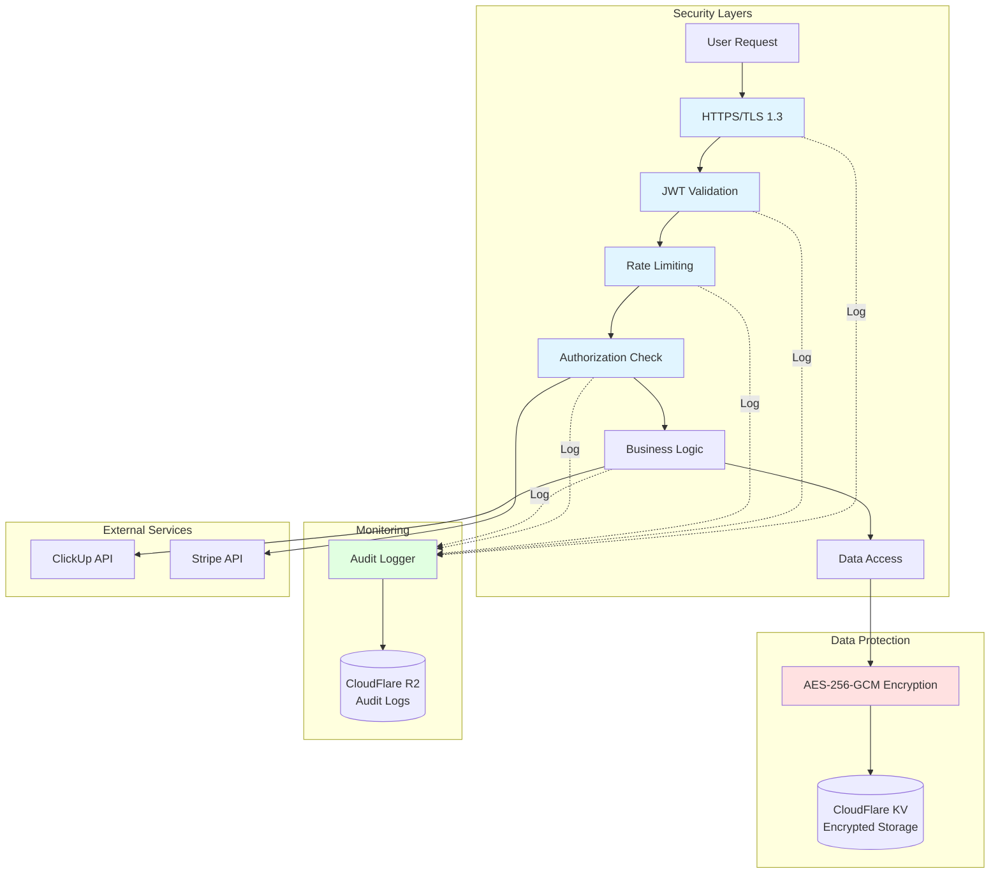
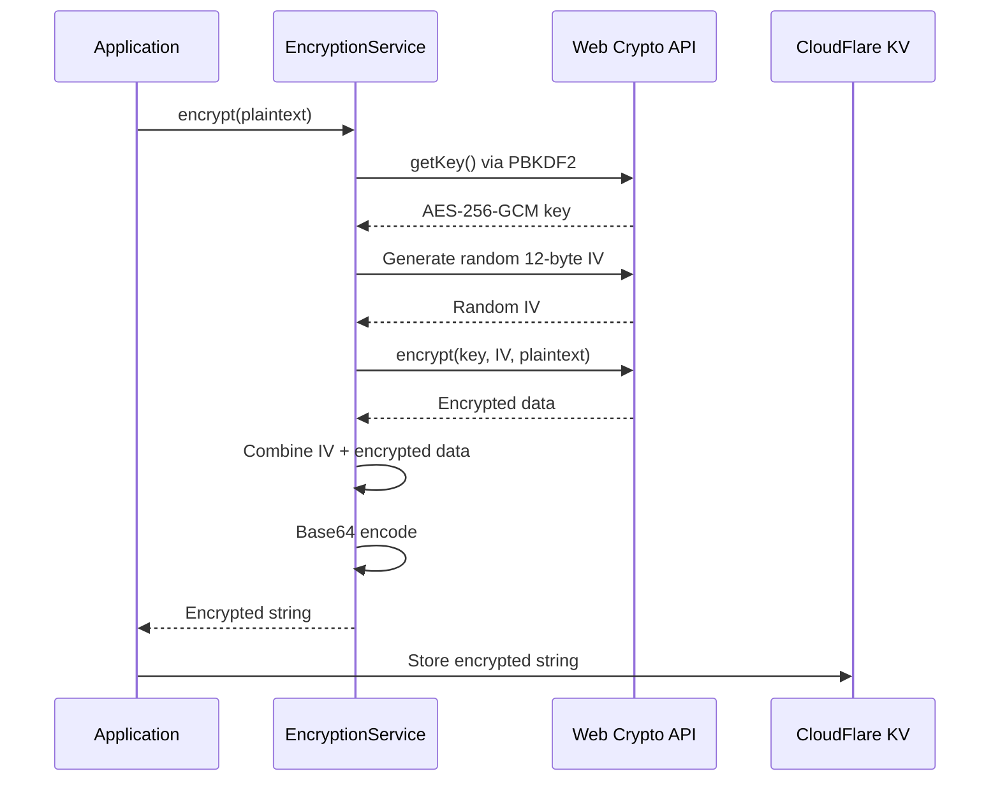

# Security Architecture & Best Practices

**Purpose**: This document provides comprehensive security documentation for the ClickUp MCP Server, covering encryption, authentication, access control, monitoring, compliance, and incident response procedures.

<!-- AI-OPTIMIZATION: Comprehensive security documentation for embeddings -->

## Table of Contents

1. [Security Overview](#security-overview)
2. [Data Protection](#data-protection)
3. [Access Control](#access-control)
4. [Monitoring & Audit Logging](#monitoring--audit-logging)
5. [Compliance](#compliance)
6. [Security Best Practices](#security-best-practices)
7. [Incident Response](#incident-response)

---

## Security Overview

### Security Architecture

The ClickUp MCP Server implements a **defense-in-depth security architecture** with multiple layers:



### Zero Trust Principles

The server follows **zero trust architecture** principles:

1. **Verify Explicitly**: Every request validated regardless of source
2. **Least Privilege Access**: Users granted minimum permissions needed
3. **Assume Breach**: Defense in depth with multiple security layers
4. **Continuous Monitoring**: All actions logged and monitored
5. **Data Encryption**: All sensitive data encrypted at rest and in transit

### CloudFlare Workers Security Benefits

**CloudFlare Workers** provide inherent security advantages:

- ✅ **Sandboxed Execution**: V8 isolate per request, complete isolation
- ✅ **No Persistent State**: Stateless execution prevents data leakage
- ✅ **Distributed Edge Deployment**: 300+ data centers globally
- ✅ **Built-in DDoS Protection**: CloudFlare's network-level protection
- ✅ **Automatic HTTPS**: TLS 1.3 enforced for all connections
- ✅ **Secrets Management**: Environment variables stored securely

---

## Data Protection

### Encryption at Rest

#### AES-256-GCM Encryption

All sensitive data (API keys, access tokens, refresh tokens) encrypted using **AES-256-GCM** (Advanced Encryption Standard with Galois/Counter Mode):

**Algorithm Properties**:
- **Key Size**: 256 bits (32 bytes) - Maximum security
- **Mode**: GCM (Galois/Counter Mode) - AEAD cipher
- **Authentication**: Built-in message authentication
- **Performance**: Hardware-accelerated on modern CPUs

**Why AES-256-GCM?**
1. ✅ **AEAD Cipher**: Provides both confidentiality AND authenticity
2. ✅ **NIST Approved**: FIPS 140-2 compliant
3. ✅ **Industry Standard**: Used by Google, AWS, Microsoft
4. ✅ **Quantum Resistant**: 256-bit keys resist quantum attacks

#### Key Derivation with PBKDF2

Encryption keys derived from base secret using **PBKDF2** (Password-Based Key Derivation Function 2):

```typescript
// Key derivation implementation
const keyMaterial = await crypto.subtle.importKey(
  'raw',
  encoder.encode(env.ENCRYPTION_KEY), // Base secret from CloudFlare Workers secrets
  { name: 'PBKDF2' },
  false,
  ['deriveBits', 'deriveKey']
);

const salt = encoder.encode('clickup-mcp-salt-v1'); // Fixed salt for deterministic derivation

const derivedKey = await crypto.subtle.deriveKey(
  {
    name: 'PBKDF2',
    salt,
    iterations: 100000,  // 100,000 iterations - computationally expensive
    hash: 'SHA-256'      // SHA-256 hash function
  },
  keyMaterial,
  { name: 'AES-GCM', length: 256 },
  false,
  ['encrypt', 'decrypt']
);
```

**PBKDF2 Parameters**:
- **Iterations**: 100,000 (OWASP recommended minimum)
- **Hash Function**: SHA-256
- **Salt**: Fixed salt (`clickup-mcp-salt-v1`)
- **Output**: 256-bit AES-GCM key

**Why Fixed Salt?**
- Base `ENCRYPTION_KEY` is already a strong random secret (32+ bytes)
- Fixed salt enables deterministic key derivation across Worker instances
- Primary defense is the secret key strength, not salt randomness
- PBKDF2 iterations (100k) provide computational cost barrier

#### Encryption Process

**Encryption Flow**:



**Code Example**:

```typescript
async encrypt(plaintext: string): Promise<string> {
  const key = await this.getKey(); // PBKDF2-derived key

  // Generate random 12-byte IV (96 bits)
  const iv = crypto.getRandomValues(new Uint8Array(12));

  // Convert plaintext to bytes
  const data = new TextEncoder().encode(plaintext);

  // Encrypt with AES-256-GCM
  const encryptedData = await crypto.subtle.encrypt(
    {
      name: 'AES-GCM',
      iv,
      tagLength: 128  // 128-bit authentication tag
    },
    key,
    data
  );

  // Combine IV and encrypted data for storage
  const combined = new Uint8Array(iv.length + encryptedData.byteLength);
  combined.set(iv);
  combined.set(new Uint8Array(encryptedData), iv.length);

  // Base64 encode for string storage
  return btoa(String.fromCharCode(...combined));
}
```

**Decryption Flow**:

```typescript
async decrypt(encryptedString: string): Promise<string> {
  const key = await this.getKey();

  // Decode base64
  const combined = Uint8Array.from(atob(encryptedString), c => c.charCodeAt(0));

  // Extract IV (first 12 bytes)
  const iv = combined.slice(0, 12);

  // Extract encrypted data (remaining bytes)
  const encryptedData = combined.slice(12);

  // Decrypt with AES-256-GCM
  const decryptedData = await crypto.subtle.decrypt(
    { name: 'AES-GCM', iv },
    key,
    encryptedData
  );

  // Convert bytes to string
  return new TextDecoder().decode(decryptedData);
}
```

#### Storage Format

**CloudFlare KV Storage Structure**:

```json
{
  "key": "user:12345:api_key",
  "value": "AAAAAAAAAAAABBBBBBBBBBBBCCCCCCCCCCCCDDDDDDDDDDDDEEEEEEEEEEEE...",
  "metadata": {
    "encrypted": true,
    "algorithm": "AES-256-GCM",
    "key_version": "v1",
    "created_at": "2025-01-28T10:30:00Z"
  }
}
```

**Value Structure** (base64 encoded):
```
[12 bytes IV] + [N bytes encrypted data] + [16 bytes GCM authentication tag]
```

**Example**:
- Plaintext: `pk_123456_abcdefghijklmnop` (ClickUp API key)
- IV: 12 random bytes
- Encrypted data: Variable length based on plaintext
- Auth tag: 16 bytes (128-bit GCM tag)
- Total stored: Base64-encoded combined data

### Encryption in Transit

#### HTTPS/TLS 1.3

All communications encrypted with **TLS 1.3** (Transport Layer Security):

**CloudFlare TLS Configuration**:
- ✅ **TLS 1.3**: Latest protocol version
- ✅ **Strong Cipher Suites**: ECDHE-RSA-AES256-GCM-SHA384
- ✅ **Perfect Forward Secrecy**: Ephemeral key exchange
- ✅ **Certificate Pinning**: CloudFlare-managed certificates
- ✅ **HSTS Enabled**: HTTP Strict Transport Security enforced

**Certificate Details**:
```bash
# View certificate
curl -vI https://clickup-mcp.workers.dev

# Example output
* TLSv1.3 (OUT), TLS handshake, Client hello (1)
* TLSv1.3 (IN), TLS handshake, Server hello (2)
* TLSv1.3 (IN), TLS handshake, Encrypted Extensions (8)
* TLSv1.3 (IN), TLS handshake, Certificate (11)
* Subject: CN=clickup-mcp.workers.dev
* Issuer: C=US, O=Let's Encrypt, CN=R3
* Cipher: TLS_AES_256_GCM_SHA384
```

#### API Communication Security

**ClickUp API Communication**:
```typescript
// All ClickUp API requests use HTTPS
const response = await fetch('https://api.clickup.com/api/v2/team', {
  method: 'GET',
  headers: {
    'Authorization': `Bearer ${decryptedApiKey}`, // Decrypted in-memory only
    'Content-Type': 'application/json'
  }
});
```

**Security Measures**:
1. ✅ API keys decrypted in-memory only (never logged)
2. ✅ HTTPS enforced for all ClickUp API calls
3. ✅ API keys never transmitted in URLs (always headers)
4. ✅ Response data sanitized before logging

### Key Management

#### CloudFlare Workers Secrets

Encryption keys stored as **CloudFlare Workers secrets**:

```bash
# Set encryption key (32+ bytes, hex-encoded)
wrangler secret put ENCRYPTION_KEY
# Enter: <strong-random-256-bit-key>

# Set JWT secret (32+ bytes)
wrangler secret put JWT_SECRET
# Enter: <strong-random-secret>

# Verify secrets (list only, values hidden)
wrangler secret list
```

**Secret Requirements**:
- **ENCRYPTION_KEY**: 32+ bytes (256+ bits), cryptographically random
- **JWT_SECRET**: 32+ bytes (256+ bits), cryptographically random
- **Storage**: CloudFlare Workers encrypted secrets storage
- **Access**: Only available to Worker runtime, not in logs

#### Key Rotation Procedure

**When to Rotate Keys**:
- 🔄 Every 90 days (recommended)
- 🚨 Immediately if key compromised
- 🚨 After security incident
- 🚨 When team member with access leaves

**Rotation Process**:

```bash
# Step 1: Generate new key
NEW_KEY=$(openssl rand -hex 32)

# Step 2: Update ENCRYPTION_KEY in CloudFlare
wrangler secret put ENCRYPTION_KEY
# Enter: $NEW_KEY

# Step 3: Deploy updated Worker
wrangler deploy --env production

# Step 4: Re-encrypt all stored data
# (Run migration script - contact support for assistance)

# Step 5: Revoke old key
# (Document old key as revoked in key management system)
```

**Important**: Key rotation requires re-encrypting all stored API keys. Plan for maintenance window.

### Data Retention

**CloudFlare KV Retention**:
- **API Keys**: Stored until user logout or account deletion
- **Session Tokens**: 24-hour TTL, automatically expired
- **OAuth State**: 5-minute TTL, automatically expired

**CloudFlare R2 Audit Logs**:
- **Retention Period**: 90 days default
- **Log Rotation**: Automatic daily rotation
- **Archival**: Optional long-term archival to external storage

**User Data Deletion**:
```bash
# User-initiated deletion
DELETE /auth/logout
# Deletes: JWT session, encrypted API keys, rate limit counters

# Administrator-initiated deletion
# Contact support for account deletion (includes audit log redaction)
```

---

## Access Control

### JWT Security

#### Token Structure and Validation

**JWT Token Structure**:
```json
{
  "header": {
    "alg": "HS256",
    "typ": "JWT"
  },
  "payload": {
    "sub": "user_12345",
    "email": "user@example.com",
    "team_id": "67890",
    "tier": "free",
    "iat": 1706436600,
    "exp": 1706523000
  },
  "signature": "..."
}
```

**Validation Process**:
```typescript
async validateJWT(token: string): Promise<JWTPayload> {
  // Step 1: Verify signature
  const payload = await this.verifySignature(token);

  // Step 2: Check expiration
  if (payload.exp < Date.now() / 1000) {
    throw new Error('Token expired');
  }

  // Step 3: Validate required claims
  if (!payload.sub || !payload.team_id) {
    throw new Error('Invalid token claims');
  }

  // Step 4: Check revocation (optional)
  const revoked = await this.env.REVOKED_TOKENS.get(token);
  if (revoked) {
    throw new Error('Token revoked');
  }

  return payload;
}
```

**Security Features**:
1. ✅ **HMAC-SHA256 Signature**: HS256 algorithm (symmetric key)
2. ✅ **Short Lifetime**: 24-hour expiration (configurable)
3. ✅ **Signature Validation**: Every request validates signature
4. ✅ **Claims Validation**: Required fields checked
5. ✅ **Revocation Support**: Optional token blacklist in KV

**JWT Security Best Practices**:
- ⚠️ **Never log tokens**: Redact from logs
- ⚠️ **Validate every request**: Don't trust client-provided data
- ⚠️ **Short expiration**: Balance security vs. UX
- ⚠️ **Secure secret**: JWT_SECRET must be strong random (32+ bytes)

#### Token Refresh Security

For detailed OAuth token refresh procedures, see [AUTHENTICATION.md - Token Refresh](AUTHENTICATION.md#token-refresh).

**Security Considerations**:
- Refresh tokens stored encrypted in CloudFlare KV
- Refresh token rotation on each use (single-use tokens)
- Refresh token expiration (30 days default)
- Automatic revocation on logout or suspicious activity

### Rate Limiting

#### Implementation Details

**Rate Limiting Strategy**:
- **Window**: 1-minute sliding window
- **Storage**: CloudFlare KV (per-user counters)
- **Granularity**: Per-user, per-action
- **Limits**: Tier-based (100/min free, 500/min premium)

**Code Example**:
```typescript
export class RateLimiter {
  private readonly windowMs = 60000; // 1 minute
  private readonly maxRequests: number;

  constructor(private env: Env) {
    this.maxRequests = parseInt(env.MAX_REQUESTS_PER_MINUTE || '100');
  }

  async checkLimit(userId: string, action: string = 'default'): Promise<RateLimitResult> {
    const key = `rate:${userId}:${action}`;
    const now = Date.now();

    // Get current rate limit entry
    const data = await this.env.RATE_LIMITS.get(key);
    let entry: RateLimitEntry;

    if (data) {
      entry = JSON.parse(data);

      // Check if window has expired
      if (now >= entry.reset_at) {
        // Reset the window
        entry = {
          count: 1,
          window_start: now,
          reset_at: now + this.windowMs
        };
      } else {
        // Within current window
        if (entry.count >= this.maxRequests) {
          return {
            allowed: false,
            limit: this.maxRequests,
            remaining: 0,
            reset_at: entry.reset_at
          };
        }
        entry.count++;
      }
    } else {
      // First request in window
      entry = {
        count: 1,
        window_start: now,
        reset_at: now + this.windowMs
      };
    }

    // Store updated entry (60-second TTL)
    await this.env.RATE_LIMITS.put(key, JSON.stringify(entry), {
      expirationTtl: 60
    });

    return {
      allowed: true,
      limit: this.maxRequests,
      remaining: this.maxRequests - entry.count,
      reset_at: entry.reset_at
    };
  }
}
```

**Rate Limit Headers**:
```http
HTTP/1.1 200 OK
X-RateLimit-Limit: 100
X-RateLimit-Remaining: 95
X-RateLimit-Reset: 1706436660
```

**Rate Limit Exceeded Response**:
```json
{
  "error": {
    "code": "rate_limited",
    "message": "Rate limit exceeded",
    "details": {
      "limit": 100,
      "reset_in_seconds": 45,
      "upgrade_url": "https://clickup-mcp.workers.dev/stripe/create-checkout"
    }
  }
}
```

#### Tier-Based Limits

**Free Tier**:
- 100 requests/minute per user
- Applied to all tool invocations
- Soft limit (returns 429 after exceeded)

**Premium Tier** ($4.99/month):
- 500 requests/minute per user
- 5x capacity increase
- Priority processing

**Custom/Enterprise**:
- Custom limits negotiable
- Dedicated infrastructure
- Contact sales for pricing

#### Rate Limiting Best Practices

**For Users**:
1. ✅ Implement exponential backoff on 429 errors
2. ✅ Cache responses when possible
3. ✅ Use bulk operations (premium) to reduce request count
4. ✅ Monitor `X-RateLimit-Remaining` header

**Example Client with Backoff**:
```python
import time
import requests

class MCPClient:
    def call_with_retry(self, method, params, max_retries=3):
        for attempt in range(max_retries):
            response = requests.post(
                'https://clickup-mcp.workers.dev/mcp',
                headers={'Authorization': f'Bearer {self.jwt_token}'},
                json={'method': method, 'params': params}
            )

            if response.status_code == 429:
                # Rate limited
                reset_after = int(response.headers.get('X-RateLimit-Reset', 60))
                wait_time = min(reset_after, 2 ** attempt)  # Exponential backoff
                print(f"Rate limited. Waiting {wait_time}s...")
                time.sleep(wait_time)
                continue

            return response.json()

        raise Exception("Max retries exceeded")
```

### Multi-Tenant Isolation

#### User Isolation Architecture

**Isolation Layers**:
1. **JWT-based User ID**: Every request tied to specific user
2. **Encrypted Storage Keys**: `user:{user_id}:api_key` namespace
3. **Rate Limit Separation**: Per-user rate limit counters
4. **Audit Log Tagging**: All logs include user_id for tracking

**Data Isolation Example**:
```typescript
// User A's data
await kv.put('user:12345:api_key', encryptedKey1);
await kv.put('user:12345:refresh_token', encryptedToken1);

// User B's data (completely isolated)
await kv.put('user:67890:api_key', encryptedKey2);
await kv.put('user:67890:refresh_token', encryptedToken2);

// User A cannot access User B's data
```

**Authorization Check**:
```typescript
async getApiKey(requestUserId: string): Promise<string> {
  // Extract user ID from JWT
  const jwtUserId = this.jwt.payload.sub;

  // Verify user can only access own data
  if (requestUserId !== jwtUserId) {
    throw new Error('Unauthorized: Cannot access other user data');
  }

  // Fetch and decrypt user's API key
  const encrypted = await this.env.KV.get(`user:${jwtUserId}:api_key`);
  return this.encryption.decrypt(encrypted);
}
```

#### Workspace Isolation

**ClickUp Team ID Validation**:
```typescript
async validateWorkspaceAccess(userId: string, teamId: string): Promise<boolean> {
  // Get user's authorized team ID from JWT
  const userTeamId = this.jwt.payload.team_id;

  // Verify team ID matches
  if (teamId !== userTeamId) {
    await this.auditLog({
      user_id: userId,
      action: 'unauthorized_workspace_access_attempt',
      team_id: teamId,
      severity: 'high'
    });
    return false;
  }

  return true;
}
```

**Security Benefits**:
- ✅ Users cannot access workspaces they don't own
- ✅ API keys scoped to specific ClickUp workspaces
- ✅ Cross-tenant attacks prevented by JWT validation
- ✅ Unauthorized access attempts logged for monitoring

---

## Monitoring & Audit Logging

### Audit Log Format

**CloudFlare R2 Audit Logging**:

All user actions logged to **CloudFlare R2** for security monitoring and compliance:

**Log Entry Structure**:
```json
{
  "timestamp": "2025-01-28T10:30:00.123Z",
  "request_id": "req_abc123",
  "user_id": "user_12345",
  "team_id": "67890",
  "action": "tool_invocation",
  "tool_name": "clickup_task_create",
  "method": "POST",
  "path": "/mcp",
  "ip_address": "203.0.113.42",
  "user_agent": "Claude Desktop/1.0",
  "jwt_token_id": "jti_xyz789",
  "status": "success",
  "duration_ms": 245,
  "details": {
    "list_id": "90144360426",
    "task_name": "Review PR #123"
  },
  "error": null
}
```

**Logged Events**:
1. **Authentication Events**:
   - OAuth login initiated
   - OAuth callback received
   - JWT token issued
   - JWT token refreshed
   - Logout/token revocation

2. **Tool Invocations**:
   - Tool name and parameters (sanitized)
   - Execution duration
   - Success/failure status
   - Error messages (sanitized)

3. **Security Events**:
   - Failed JWT validation
   - Rate limit exceeded
   - Unauthorized access attempts
   - Suspicious activity detected

4. **Administrative Actions**:
   - Tier upgrades/downgrades
   - API key rotation
   - Configuration changes

### Audit Log Storage

**R2 Storage Structure**:
```
audit-logs/
├── 2025/
│   ├── 01/
│   │   ├── 28/
│   │   │   ├── 00-auth-events.jsonl
│   │   │   ├── 00-tool-invocations.jsonl
│   │   │   ├── 00-security-events.jsonl
│   │   │   ├── 01-auth-events.jsonl
│   │   │   ├── 01-tool-invocations.jsonl
│   │   │   └── ...
```

**Log Rotation**:
- **Frequency**: Hourly rotation
- **Format**: JSONL (JSON Lines) for efficient parsing
- **Compression**: Gzip compression after rotation
- **Retention**: 90 days default (configurable)

**Querying Logs**:
```bash
# Download logs for specific date
wrangler r2 object get audit-logs audit-logs/2025/01/28/10-tool-invocations.jsonl.gz --file logs.jsonl.gz

# Decompress and parse
gunzip logs.jsonl.gz
cat logs.jsonl | jq 'select(.user_id == "user_12345")'
```

### Real-Time Monitoring

**Metrics Tracked**:
1. **Performance Metrics**:
   - Request latency (p50, p95, p99)
   - Tool execution duration
   - ClickUp API response times

2. **Security Metrics**:
   - Failed authentication attempts
   - Rate limit violations
   - Suspicious activity patterns

3. **Business Metrics**:
   - Active users (DAU/MAU)
   - Tool usage by category
   - Premium tier adoption

**Alerting Rules**:
```yaml
# Example alert configuration
alerts:
  - name: High Failed Auth Rate
    condition: failed_auth_count > 10 in 5 minutes
    severity: high
    action: notify_security_team

  - name: Unusual API Key Access
    condition: api_key_decrypt_count > 1000 in 1 minute
    severity: critical
    action: auto_block_user

  - name: Rate Limit Saturation
    condition: rate_limit_exceeded_percentage > 50
    severity: medium
    action: notify_capacity_planning
```

### Data Sanitization

**Sensitive Data Redaction**:

```typescript
function sanitizeForLogging(data: any): any {
  const redactKeys = [
    'password', 'api_key', 'token', 'secret',
    'authorization', 'jwt', 'refresh_token'
  ];

  if (typeof data === 'object') {
    const sanitized = { ...data };
    for (const key of Object.keys(sanitized)) {
      if (redactKeys.some(k => key.toLowerCase().includes(k))) {
        sanitized[key] = '[REDACTED]';
      } else if (typeof sanitized[key] === 'object') {
        sanitized[key] = sanitizeForLogging(sanitized[key]);
      }
    }
    return sanitized;
  }

  return data;
}
```

**Example Sanitized Log**:
```json
{
  "timestamp": "2025-01-28T10:30:00Z",
  "action": "oauth_callback",
  "details": {
    "code": "[REDACTED]",
    "state": "state_abc123",
    "api_key": "[REDACTED]",
    "team_id": "67890"
  }
}
```

---

## Compliance

### GDPR Compliance

#### Data Processing

**Legal Basis for Processing**:
- **Consent**: User explicitly authorizes OAuth access
- **Contractual Necessity**: Processing required to provide service
- **Legitimate Interest**: Security monitoring and fraud prevention

**Data Categories**:
1. **Personal Data**:
   - Email address
   - ClickUp user ID
   - IP address (audit logs only)

2. **Technical Data**:
   - JWT tokens
   - Encrypted API keys
   - Usage metrics

3. **Special Categories**: None (no sensitive personal data)

#### User Rights

**Right to Access** (GDPR Article 15):
```bash
# User can request all stored data
GET /user/data-export
Authorization: Bearer JWT_TOKEN

# Response includes:
# - Encrypted API key (not decrypted)
# - JWT token claims
# - Audit logs for user
# - Subscription status
```

**Right to Erasure** (GDPR Article 17):
```bash
# User can request account deletion
DELETE /user/account
Authorization: Bearer JWT_TOKEN

# Deletes:
# - Encrypted API keys
# - JWT sessions
# - Rate limit counters
# - Redacts audit logs (replaces user_id with "deleted_user")
```

**Right to Data Portability** (GDPR Article 20):
```bash
# Export data in machine-readable format
GET /user/data-export?format=json
Authorization: Bearer JWT_TOKEN

# Returns JSON with:
# - User profile
# - Audit logs
# - Usage statistics
```

**Right to Rectification** (GDPR Article 16):
```bash
# Update user data (email, preferences)
PATCH /user/profile
Authorization: Bearer JWT_TOKEN
Content-Type: application/json

{
  "email": "newemail@example.com"
}
```

#### Data Retention Policy

**Retention Periods**:
| Data Type | Retention | Reason |
|-----------|-----------|--------|
| Encrypted API Keys | Until logout/deletion | Service operation |
| JWT Sessions | 24 hours | Security (short-lived) |
| Audit Logs | 90 days | Security monitoring, compliance |
| Billing Records | 7 years | Tax compliance (Stripe) |
| Deleted User Data | Immediate deletion | GDPR compliance |

**Automatic Deletion**:
```typescript
// JWT sessions auto-expire
await kv.put(`session:${sessionId}`, jwt, {
  expirationTtl: 86400  // 24 hours
});

// Rate limit counters auto-expire
await kv.put(`rate:${userId}`, counter, {
  expirationTtl: 60  // 1 minute
});
```

#### Data Processing Agreement

**CloudFlare as Data Processor**:
- CloudFlare Workers hosts the application
- CloudFlare KV/R2 stores encrypted data
- Data Processing Agreement in place
- GDPR-compliant infrastructure
- EU data residency available (optional)

**ClickUp as Data Processor**:
- ClickUp stores task data
- User's ClickUp account determines data residency
- ClickUp's Data Processing Agreement applies
- See [ClickUp Privacy Policy](https://clickup.com/privacy)

#### Privacy by Design

**Privacy Measures**:
1. ✅ **Data Minimization**: Only collect necessary data
2. ✅ **Encryption by Default**: All sensitive data encrypted
3. ✅ **Short Retention**: JWT sessions expire in 24 hours
4. ✅ **Access Controls**: Users can only access own data
5. ✅ **Audit Trail**: Complete action logging for accountability
6. ✅ **Right to Erasure**: Automated deletion procedures

### SOC 2 Compliance (Planned)

**CloudFlare SOC 2 Type II**:
- CloudFlare Workers infrastructure is SOC 2 Type II certified
- Covers security, availability, confidentiality

**Application-Level Controls** (Roadmap):
- Security policies and procedures documentation
- Regular penetration testing
- Incident response procedures
- Change management processes
- Access control reviews

### CCPA Compliance

**California Consumer Privacy Act (CCPA)**:

**Consumer Rights**:
1. **Right to Know**: Users can request data categories collected
2. **Right to Delete**: Users can request data deletion
3. **Right to Opt-Out**: Users can opt out of data "sale" (N/A - no data selling)

**Implementation**:
- Same data export/deletion endpoints as GDPR
- Privacy policy clearly states data usage
- No data selling or third-party sharing (except CloudFlare, ClickUp as processors)

---

## Security Best Practices

### For Users

#### JWT Token Security

**Protecting Your JWT Token**:

1. ✅ **Secure Storage**:
```typescript
// ❌ Don't store in localStorage (XSS risk)
localStorage.setItem('jwt', token);

// ✅ Store in memory or secure cookie
// (If using browser, use httpOnly cookie)
document.cookie = `jwt=${token}; Secure; HttpOnly; SameSite=Strict`;
```

2. ✅ **Never Share Tokens**:
   - Don't paste tokens in Slack/Discord
   - Don't commit tokens to Git repositories
   - Don't share tokens with third parties

3. ✅ **Monitor Token Usage**:
```bash
# Check audit logs for suspicious activity
GET /user/audit-logs?since=2025-01-28
Authorization: Bearer JWT_TOKEN
```

4. ✅ **Rotate Tokens Regularly**:
   - Logout and re-authenticate every 30 days
   - Immediately rotate if token potentially compromised

#### API Key Security

**ClickUp API Key Protection**:

1. ✅ **OAuth Preferred**: Use OAuth flow instead of manual API keys
2. ✅ **Never Log API Keys**: Redact from logs and error messages
3. ✅ **Rotate Immediately if Compromised**:
```bash
# If API key compromised
1. Revoke key in ClickUp (Settings → Apps → Regenerate)
2. Logout from MCP Server: POST /auth/logout
3. Re-authenticate via OAuth: GET /auth/login
```

#### Network Security

1. ✅ **Use HTTPS Only**: Never use HTTP endpoints
2. ✅ **Verify TLS Certificates**: Ensure legitimate cloudflare-workers.dev domain
3. ✅ **Avoid Public Wi-Fi**: Use VPN when on untrusted networks

### For Administrators

#### Self-Hosting Security

**If Self-Hosting on CloudFlare Workers**:

1. ✅ **Generate Strong Secrets**:
```bash
# Generate ENCRYPTION_KEY (32 bytes, 256 bits)
openssl rand -hex 32

# Generate JWT_SECRET (32 bytes, 256 bits)
openssl rand -hex 32

# Set in CloudFlare Workers
wrangler secret put ENCRYPTION_KEY
wrangler secret put JWT_SECRET
```

2. ✅ **OAuth App Configuration**:
```bash
# In ClickUp (Settings → Integrations → OAuth Apps):
- App Name: My ClickUp MCP Server
- Redirect URI: https://your-worker.workers.dev/auth/callback
- Enable PKCE: No (server-side OAuth with client_secret)

# Set secrets
wrangler secret put CLICKUP_CLIENT_ID
wrangler secret put CLICKUP_CLIENT_SECRET
```

3. ✅ **Environment Variables**:
```toml
# wrangler.toml
[env.production]
name = "clickup-mcp-production"

[env.production.vars]
OAUTH_REDIRECT_URI = "https://your-worker.workers.dev/auth/callback"
MAX_REQUESTS_PER_MINUTE = "100"
ENABLE_AUDIT_LOGGING = "true"

# Secrets (use wrangler secret put):
# ENCRYPTION_KEY
# JWT_SECRET
# CLICKUP_CLIENT_ID
# CLICKUP_CLIENT_SECRET
```

4. ✅ **Regular Updates**:
```bash
# Update dependencies
npm update

# Review security advisories
npm audit

# Fix vulnerabilities
npm audit fix

# Deploy updated Worker
wrangler deploy --env production
```

#### Access Control

1. ✅ **Principle of Least Privilege**:
   - Limit CloudFlare Workers permissions
   - Restrict KV/R2 access to specific namespaces
   - Use separate Workers for dev/staging/production

2. ✅ **Multi-Factor Authentication**:
   - Enable MFA on CloudFlare account
   - Enable MFA on ClickUp admin account
   - Use hardware security keys (YubiKey)

3. ✅ **Audit Log Monitoring**:
```bash
# Set up alerts for suspicious activity
wrangler r2 object get audit-logs audit-logs/2025/01/28/10-security-events.jsonl.gz \
  | gunzip | jq 'select(.severity == "high")'
```

#### Incident Response

**Security Incident Checklist**:

1. **Detect**:
   - Monitor audit logs for anomalies
   - Alert on failed authentication spikes
   - Track rate limit violations

2. **Contain**:
   - Revoke compromised JWT tokens
   - Block suspicious IP addresses
   - Disable compromised user accounts

3. **Investigate**:
   - Review audit logs for timeline
   - Identify affected users
   - Determine attack vector

4. **Recover**:
   - Rotate encryption keys if needed
   - Force password resets for affected users
   - Update security configurations

5. **Learn**:
   - Document incident details
   - Update security procedures
   - Implement additional monitoring

---

## Incident Response

### Incident Classification

**Severity Levels**:

| Level | Description | Examples | Response Time |
|-------|-------------|----------|---------------|
| **Critical** | Data breach, system compromise | API keys exposed, unauthorized data access | Immediate (< 1 hour) |
| **High** | Security vulnerability, failed controls | JWT validation bypass, encryption failure | 4 hours |
| **Medium** | Suspicious activity, policy violation | Unusual access patterns, rate limit abuse | 24 hours |
| **Low** | Security informational, minor issues | Failed login attempts, configuration drift | 1 week |

### Response Procedures

#### 1. Detection and Alerting

**Automated Detection**:
```typescript
// Monitor audit logs for anomalies
async detectAnomalies() {
  const logs = await this.getRecentLogs(60); // Last 60 minutes

  // High failed authentication rate
  const failedAuthCount = logs.filter(l =>
    l.action === 'jwt_validation_failed'
  ).length;

  if (failedAuthCount > 10) {
    await this.alert('High failed authentication rate', 'high');
  }

  // Unusual API key access patterns
  const apiKeyAccess = logs.filter(l =>
    l.action === 'api_key_decrypted'
  ).length;

  if (apiKeyAccess > 1000) {
    await this.alert('Unusual API key access', 'critical');
  }
}
```

**Manual Detection**:
- User reports suspicious activity
- Third-party security research disclosure
- CloudFlare security notifications

#### 2. Containment

**Immediate Actions**:

```bash
# Revoke specific user's JWT tokens
wrangler kv:key delete SESSIONS --binding=SESSIONS --key="session:user_12345"

# Block IP address
wrangler kv:key put BLOCKED_IPS --binding=BLOCKED_IPS --key="203.0.113.42" --value="blocked"

# Disable compromised user account
curl -X POST https://clickup-mcp.workers.dev/admin/users/user_12345/disable \
  -H "Authorization: Bearer ADMIN_TOKEN"
```

**Escalation**:
- Critical incidents: Notify security team immediately
- High incidents: Security team within 4 hours
- Medium incidents: Queue for next business day review

#### 3. Investigation

**Forensic Analysis**:

```bash
# Extract audit logs for affected user
wrangler r2 object get audit-logs audit-logs/2025/01/28/ --prefix --file logs/

# Analyze timeline
cat logs/*.jsonl | jq 'select(.user_id == "user_12345") | [.timestamp, .action, .status]' | less

# Identify attack vector
cat logs/*.jsonl | jq 'select(.status == "error" or .severity == "high")' | less
```

**Questions to Answer**:
1. What data was accessed?
2. How did the attacker gain access?
3. When did the breach occur?
4. What was the extent of the compromise?
5. Are other users affected?

#### 4. Recovery

**Remediation Steps**:

1. **Rotate Compromised Secrets**:
```bash
# Generate new encryption key
NEW_KEY=$(openssl rand -hex 32)
wrangler secret put ENCRYPTION_KEY

# Force all users to re-authenticate
wrangler kv:key delete SESSIONS --binding=SESSIONS --prefix="session:"
```

2. **Patch Vulnerabilities**:
```bash
# Update dependencies
npm update

# Apply security patches
git cherry-pick <security-patch-commit>

# Deploy fixed version
wrangler deploy --env production
```

3. **Notify Affected Users**:
```typescript
// Send notification emails
const affectedUsers = ['user_12345', 'user_67890'];
for (const userId of affectedUsers) {
  await sendSecurityNotification(userId, {
    incident: 'Security incident detected',
    action: 'Your session has been revoked. Please log in again.',
    date: new Date().toISOString()
  });
}
```

#### 5. Post-Incident Review

**Documentation**:
```markdown
# Incident Report: API Key Exposure

**Date**: 2025-01-28
**Severity**: Critical
**Status**: Resolved

## Summary
User reported their API key was visible in error logs.

## Timeline
- 10:00 UTC: User reports issue
- 10:15 UTC: Confirmed API key in audit logs
- 10:30 UTC: Logs sanitized, key rotated
- 11:00 UTC: User re-authenticated successfully

## Root Cause
Error handling code logged full request body including Authorization header.

## Remediation
- Sanitization function added to error logger
- Regression test added to prevent future occurrences
- All audit logs reviewed and sanitized

## Lessons Learned
- Need automated testing for log sanitization
- Consider separate error logging service with built-in redaction
```

### Security Contacts

**Responsible Disclosure**:
- Email: security@yourapp.com
- PGP Key: [Public key URL]
- Response Time: 24 hours acknowledgment

**Bounty Program** (Planned):
- Rewards for security vulnerabilities
- Guidelines: [URL]

---

## Additional Resources

### Related Documentation

- [Authentication Guide](AUTHENTICATION.md) - OAuth 2.0 flow and JWT tokens
- [Premium Features](PREMIUM_FEATURES.md) - Tier-based access and rate limits
- [API Reference](API_REFERENCE.md) - MCP protocol and tool documentation
- [Deployment Guide](DEPLOYMENT.md) - Self-hosting security configuration

### Security Tools

**Recommended Security Tools**:
```bash
# CloudFlare Wrangler
npm install -g wrangler

# Security scanning
npm install -g snyk
snyk test

# Dependency auditing
npm audit

# JWT validation
npm install jsonwebtoken
```

### Security Checklist

**Pre-Deployment Security Checklist**:

- [ ] Strong encryption keys generated (32+ bytes)
- [ ] OAuth client secret configured securely
- [ ] HTTPS enforced for all endpoints
- [ ] JWT signature validation enabled
- [ ] Rate limiting configured per tier
- [ ] Audit logging enabled to R2
- [ ] Data sanitization in place
- [ ] User data encryption verified
- [ ] CloudFlare Workers secrets set
- [ ] Security headers configured
- [ ] Incident response procedures documented

---

*Last Updated: 2025-10-28*
*For security issues, contact: security@yourapp.com*
