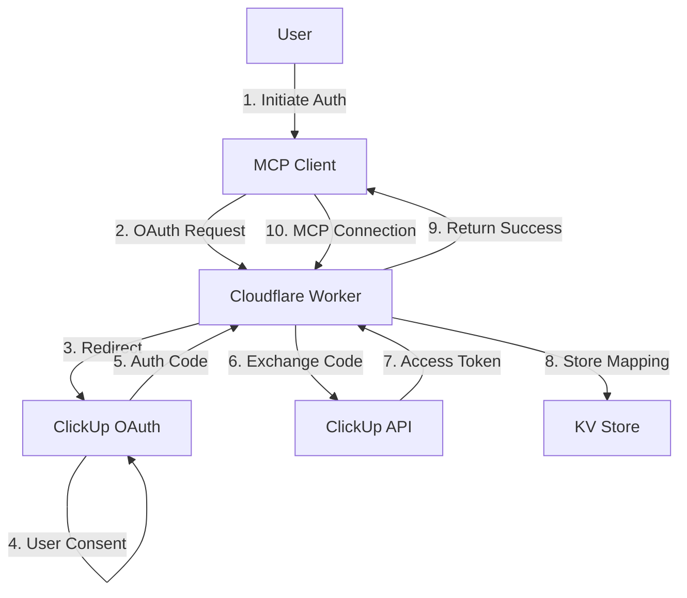

# ClickUp MCP Server - Cloudflare Workers Deployment Plan

## Executive Summary

This document outlines the complete plan for deploying the ClickUp MCP Server as a Remote MCP Server on Cloudflare Workers with OAuth authentication. The deployment will enable users to securely access their ClickUp workspaces through AI agents without managing API keys directly.

## Current State Assessment

### Codebase Status
- **Build Process**: ✅ Working correctly with TypeScript compilation
- **Dependencies**: All core dependencies installed and functional
- **Architecture**: Service-oriented with composition pattern
- **Transport**: Currently supports STDIO and SSE, needs HTTP Streamable for Cloudflare
- **Tools**: 65+ tools across 13 categories
- **Testing**: ❌ No existing test suite

### Required Environment Variables
- `CLICKUP_API_KEY`: User's ClickUp API key
- `CLICKUP_TEAM_ID`: User's team ID

## Architecture Design

### OAuth Flow & User Authentication



### Data Storage Architecture

```
Cloudflare KV Namespaces:
1. USER_SESSIONS: OAuth sessions and tokens
2. API_KEYS: Encrypted ClickUp API keys
3. USER_MAPPINGS: User ID to configuration mappings
4. RATE_LIMITS: Per-user rate limiting data
```

### Security Model

```
1. OAuth 2.0 with PKCE
2. Encrypted API key storage (using Web Crypto API)
3. Session-based authentication
4. Rate limiting per user
5. Audit logging to R2
```

## Implementation Tasks

### Phase 1: Core Infrastructure

#### 1. Test Suite Creation
```typescript
// test/tools.test.ts
describe('ClickUp MCP Tools', () => {
  describe('Task Management', () => {
    test('Create task with natural language date');
    test('Update task with custom fields');
    test('Bulk operations handling');
  });
  
  describe('Workspace Navigation', () => {
    test('Hierarchy resolution');
    test('Name disambiguation');
  });
});
```

#### 2. OAuth Implementation
```typescript
// src/auth/oauth.ts
export class OAuthProvider {
  async initiateFlow(state: string): Promise<string>;
  async exchangeCode(code: string): Promise<TokenResponse>;
  async refreshToken(refreshToken: string): Promise<TokenResponse>;
  async validateSession(sessionId: string): Promise<boolean>;
}
```

#### 3. User Management Service
```typescript
// src/services/user-management.ts
export class UserManagementService {
  async createUser(authData: AuthData): Promise<User>;
  async storeAPIKey(userId: string, encryptedKey: string): Promise<void>;
  async retrieveAPIKey(userId: string): Promise<string>;
  async updateUserConfig(userId: string, config: UserConfig): Promise<void>;
}
```

### Phase 2: Cloudflare Workers Adaptation

#### 1. Worker Entry Point
```typescript
// src/worker.ts
import { Hono } from 'hono';
import { MCPServer } from './mcp-server';

interface Env {
  USER_SESSIONS: KVNamespace;
  API_KEYS: KVNamespace;
  USER_MAPPINGS: KVNamespace;
  RATE_LIMITS: KVNamespace;
  AUDIT_LOGS: R2Bucket;
  CLICKUP_CLIENT_ID: string;
  CLICKUP_CLIENT_SECRET: string;
  ENCRYPTION_KEY: string;
}

const app = new Hono<{ Bindings: Env }>();

// OAuth endpoints
app.get('/auth/login', async (c) => {});
app.get('/auth/callback', async (c) => {});
app.post('/auth/refresh', async (c) => {});

// MCP endpoints
app.post('/mcp', async (c) => {});
app.get('/mcp/sse', async (c) => {}); // SSE transport
app.ws('/mcp/ws', async (c) => {}); // WebSocket transport

export default app;
```

#### 2. Transport Adaptation
```typescript
// src/transports/http-streamable.ts
export class HTTPStreamableTransport {
  async handleRequest(request: Request): Promise<Response>;
  streamResponse(data: any): ReadableStream;
}
```

#### 3. Configuration Management
```typescript
// src/config/worker-config.ts
export class WorkerConfig {
  static fromEnv(env: Env): Config;
  validateRequiredBindings(): void;
  getFeatureFlags(): FeatureFlags;
}
```

### Phase 3: Security Implementation

#### 1. Encryption Service
```typescript
// src/security/encryption.ts
export class EncryptionService {
  async encrypt(data: string, key: CryptoKey): Promise<string>;
  async decrypt(encrypted: string, key: CryptoKey): Promise<string>;
  async deriveKey(password: string, salt: Uint8Array): Promise<CryptoKey>;
}
```

#### 2. Rate Limiting
```typescript
// src/middleware/rate-limit.ts
export class RateLimiter {
  async checkLimit(userId: string, action: string): Promise<boolean>;
  async incrementCounter(userId: string, action: string): Promise<void>;
  async resetLimits(userId: string): Promise<void>;
}
```

#### 3. Audit Logging
```typescript
// src/security/audit.ts
export class AuditLogger {
  async logAction(userId: string, action: AuditAction): Promise<void>;
  async queryLogs(userId: string, timeRange: TimeRange): Promise<AuditLog[]>;
}
```

### Phase 4: Deployment Configuration

#### 1. Wrangler Configuration
```toml
# wrangler.toml
name = "clickup-mcp-server"
main = "dist/worker.js"
compatibility_date = "2025-01-01"

[env.production]
kv_namespaces = [
  { binding = "USER_SESSIONS", id = "xxx" },
  { binding = "API_KEYS", id = "xxx" },
  { binding = "USER_MAPPINGS", id = "xxx" },
  { binding = "RATE_LIMITS", id = "xxx" }
]

r2_buckets = [
  { binding = "AUDIT_LOGS", bucket_name = "clickup-mcp-audit" }
]

[env.production.vars]
CLICKUP_CLIENT_ID = "xxx"
ENVIRONMENT = "production"

[env.production.secrets]
CLICKUP_CLIENT_SECRET = "xxx"
ENCRYPTION_KEY = "xxx"
```

#### 2. Deployment Scripts
```json
// package.json additions
{
  "scripts": {
    "build:worker": "esbuild src/worker.ts --bundle --format=esm --outfile=dist/worker.js",
    "deploy:staging": "wrangler deploy --env staging",
    "deploy:production": "wrangler deploy --env production",
    "tail": "wrangler tail",
    "test:integration": "vitest run --config vitest.integration.config.ts"
  }
}
```

## Testing Strategy

### Unit Tests
- Service layer methods
- OAuth flow logic
- Encryption/decryption
- Rate limiting logic

### Integration Tests
- End-to-end OAuth flow
- MCP protocol compliance
- ClickUp API interactions
- KV storage operations

### Load Testing
```bash
# Using k6 for load testing
k6 run --vus 100 --duration 30s load-test.js
```

## Migration Path

### Step 1: Local Development
1. Implement OAuth provider
2. Create user management service
3. Add encryption layer
4. Write comprehensive tests

### Step 2: Staging Deployment
1. Deploy to Cloudflare Workers staging environment
2. Test OAuth flow with test users
3. Verify all MCP tools work correctly
4. Performance testing

### Step 3: Production Rollout
1. Create production KV namespaces
2. Configure production OAuth app in ClickUp
3. Deploy with monitoring
4. Gradual user onboarding

## Monitoring & Observability

### Metrics to Track
- OAuth success/failure rates
- API call latency
- Rate limit hits
- Error rates by tool
- User session duration

### Alerting Rules
- OAuth failures > 5% in 5 minutes
- API latency > 2 seconds p95
- KV storage errors
- Rate limit violations

## Security Considerations

### Data Protection
- All API keys encrypted at rest
- TLS for all communications
- Session tokens with 24-hour expiry
- PKCE for OAuth flow

### Access Control
- Per-user isolation
- Team-based permissions
- Audit logging for all actions
- Rate limiting per user/action

## Cost Estimation

### Cloudflare Workers Pricing
- Requests: $0.15 per million requests
- KV Storage: $0.50 per million reads
- R2 Storage: $0.015 per GB/month
- Estimated monthly cost for 1000 users: ~$50-100

## Timeline

### Week 1-2: Foundation
- [ ] Create test suite
- [ ] Implement OAuth provider
- [ ] User management service
- [ ] Encryption layer

### Week 3-4: Worker Adaptation
- [ ] Convert to Worker format
- [ ] Implement HTTP Streamable transport
- [ ] KV storage integration
- [ ] Rate limiting

### Week 5: Testing & Refinement
- [ ] Integration testing
- [ ] Load testing
- [ ] Security audit
- [ ] Documentation

### Week 6: Deployment
- [ ] Staging deployment
- [ ] Production setup
- [ ] Monitoring setup
- [ ] User onboarding

## Success Criteria

1. **Functional Requirements**
   - All 65+ tools working via remote MCP
   - OAuth flow completes in < 30 seconds
   - API response time < 500ms p50

2. **Security Requirements**
   - Zero plaintext API keys stored
   - All sessions authenticated
   - Audit trail for all actions

3. **Scalability Requirements**
   - Support 1000+ concurrent users
   - < 100ms KV lookup time
   - Automatic rate limiting

4. **User Experience**
   - One-click OAuth setup
   - No manual API key management
   - Clear error messages

## Next Steps

1. **Immediate Actions**
   - Set up test framework
   - Create OAuth application in ClickUp
   - Initialize Cloudflare Workers project

2. **Development Priorities**
   - OAuth implementation
   - User management
   - Worker conversion

3. **Documentation Needs**
   - User setup guide
   - Developer documentation
   - API reference

## Appendix

### A. Tool Categories
1. Workspace (hierarchy, navigation)
2. Task Management (CRUD, bulk ops)
3. Time Tracking
4. Lists & Folders
5. Tags & Labels
6. Team Members
7. Spaces
8. Dependencies
9. Custom Fields
10. Projects
11. Advanced Tasks
12. Documents
13. Comments & Attachments

### B. Required NPM Packages
```json
{
  "dependencies": {
    "@cloudflare/workers-types": "^4.x",
    "hono": "^4.x",
    "jose": "^5.x",
    "@modelcontextprotocol/sdk": "^1.x"
  },
  "devDependencies": {
    "wrangler": "^3.x",
    "vitest": "^2.x",
    "@vitest/ui": "^2.x",
    "esbuild": "^0.x"
  }
}
```

### C. Environment Variables
```env
# OAuth Configuration
CLICKUP_CLIENT_ID=xxx
CLICKUP_CLIENT_SECRET=xxx
OAUTH_REDIRECT_URI=https://your-worker.workers.dev/auth/callback

# Security
ENCRYPTION_KEY=xxx
SESSION_SECRET=xxx

# Feature Flags
ENABLE_AUDIT_LOGGING=true
ENABLE_RATE_LIMITING=true
MAX_REQUESTS_PER_MINUTE=100
```

### D. API Endpoints
```
GET  /auth/login         - Initiate OAuth flow
GET  /auth/callback      - OAuth callback handler
POST /auth/refresh       - Refresh access token
POST /auth/logout        - Terminate session

POST /mcp               - HTTP Streamable MCP endpoint
GET  /mcp/sse          - Server-Sent Events endpoint
WS   /mcp/ws           - WebSocket endpoint

GET  /health           - Health check
GET  /metrics          - Prometheus metrics
```